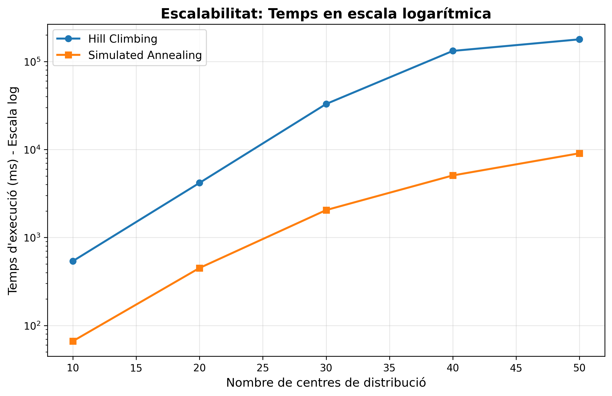
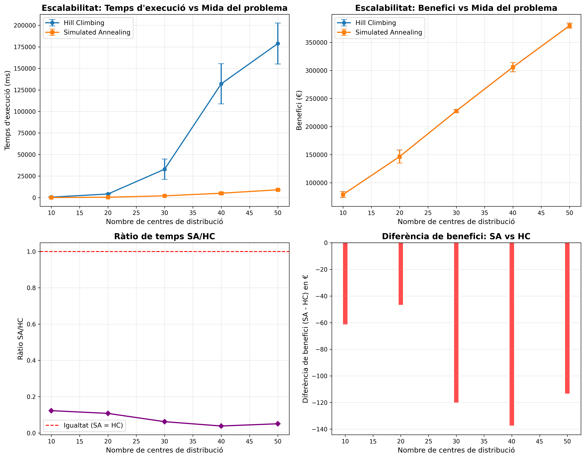

## 0. Taula de continguts

- [0. Taula de continguts](#0-taula-de-continguts)
- [1. Introducció](#1-introducció)
- [2. Objectius i metodologia](#2-objectius-i-metodologia)
- [3. Implementació en Python](#3-implementació-en-python)
- [4. Experimentació](#4-experimentació)
  - [4.1 Experiment 1: Selecció d'Operadors](#41-experiment-1-selecció-doperadors)
  - [4.2 Experiment 2: Estratègia d'Inicialització](#42-experiment-2-estratègia-dinicialització)
  - [4.3 Experiment 3: Calibratge de Simulated Annealing](#43-experiment-3-calibratge-de-simulated-annealing)
  - [4.4 Experiment 4: Escalabilitat Temporal](#44-experiment-4-escalabilitat-temporal)
    - [4.4.1 Plantejament del problema](#441-plantejament-del-problema)
    - [4.4.2 Mètode](#442-mètode)
    - [4.4.3 Resultats](#443-resultats)
    - [4.4.4 Conclusions](#444-conclusions)
  - [4.5 Experiment 5: Consolidació de Centres](#45-experiment-5-consolidació-de-centres)
  - [4.6 Experiment 6: Sensibilitat al Cost per Km](#46-experiment-6-sensibilitat-al-cost-per-km)
  - [4.7 Experiment 7: Variació de l'Horari Laboral](#47-experiment-7-variació-de-lhorari-laboral)
  - [4.8 Experiment 8: Validació de Resultats (Experiment Especial)](#48-experiment-8-validació-de-resultats-experiment-especial)
- [5. Conclusions](#5-conclusions)

## 1. Introducció

En aquest informe es presenta l’anàlisi, disseny i implementació d’algorismes de cerca local aplicats a la resolució del problema exposat a l’enunciat. L’objectiu principal del projecte és explorar com diferents tècniques d’optimització poden ser utilitzades per millorar la presa de decisions en un entorn complex, en què es busca maximitzar el benefici total del sistema mentre es compleixen restriccions operatives com els límits de recorreguts i la capacitat dels camions.

## 2. Objectius i metodologia

## 3. Representació del problema
En aquesta secció es descriu com s'ha representat el problema proposat mitjançant algorismes de cerca local. S'inclouen els detalls sobre l'estat, la solució inicial, els operadors de cerca i la funció heurística utilitzada. Aquesta representació és fonamental per al correcte funcionament dels algorismes de cerca local, ja que determina com es poden explorar les solucions possibles i com es pot avaluar la qualitat d'aquestes solucions.

### 3.1. Definició de l'Estat
Hem definit l'estat com una assignació de peticions de gasolineres als camions dels centres de distribució, tenint en compte les restriccions de distància, viatges màxims per camió i nombre màxim de peticions per viatge. Cada estat inclou la informació sobre quines peticions són ateses per cada camió, així com dintre de quin viatge es troba assignada cada petició.

### 3.2. La solució inicial
La solució inicial és el punt de partida per als algorismes de cerca local, i la seva qualitat pot influir significativament en el rendiment de l'algorisme. Hem implementat tres possibles estratègies d'inicialització:
- **Solució Buida:** En la solució buida, deixem tots els camions sense cap petició assignada. Aquesta estratègia és molt simple, amb un cost O(1), cosa que la fa molt eficient en termes de temps. Però, la qualitat de la solució és molt baixa: tot i ser una solució vàlida, ja que a l'enunciat no es prohibeix no atendre cap petició, el punt de partida és molt pobre i l'algorisme haurà de treballar molt per millorar-la. Es una estratègia que pot ser útil per avaluar la capacitat de l'algorisme per trobar bones solucions des d'un punt de partida molt dolent, però en la pràctica no és recomanable per a problemes reals, i no creiem que pugui donar bons resultats en aquest cas.
- **Inicialització Aleatòria:** En aquesta estratègia, assignem les peticions més properes a cada centre de distribució fins a omplir la seva capacitat, tenint en compte el nombre màxim de viatges que pot fer cada camió. Aquesta estratègia és més complexa que la solució buida, amb un cost O(n log n) degut a la necessitat de calcular distàncies i ordenar les peticions per proximitat. La qualitat de la solució inicial és moderada, ja que es basa en la proximitat geogràfica, però no té en compte altres factors com les penalitzacions de les peticions. Aquesta estratègia pot ser útil per a problemes on la proximitat és un factor important, però pot no ser suficient per obtenir bones solucions en problemes més complexos.
- **Inicialització Greedy:** Aquesta estratègia assigna les peticions als camions de manera que es maximitzi el benefici immediat, tenint en compte els ingressos per petició, els costos de transport i les penalitzacions per no atendre peticions. Aquesta estratègia és la més complexa de les tres, amb un cost O(n^2) degut a la necessitat d'avaluar múltiples opcions d'assignació per maximitzar el benefici. La qualitat de la solució inicial és alta, ja que es basa en una anàlisi detallada dels costos i beneficis associats a cada petició. Aquesta estratègia serà la més recomanable, ja que partint d'una bona solució inicial, els algorismes de cerca local tindran menys feina per millorar-la i podran trobar solucions òptimes més ràpidament.

### 3.3. Els operadors de cerca
Els operadors de cerca són les funcions que permeten explorar l'espai d'estats veïns a partir d'un estat actual. És important dissenyar operadors que permetin una exploració efectiva de l'espai d'estats, que evitin sortir de l'espai de solucions vàlides, que tinguin un cost computacional raonable i que peretin explorar tot l'espai de solucions.
Hem implementat tres operadors principals:
- **swapCentres:** Aquest operador intercanvia els centres de distribució assignats a dos camions diferents, que és el mateix que intercanviar les peticions assignades als camions. Això permet explorar diferents configuracions d'assignació de peticions als centres, i pot ajudar a trobar solucions més òptimes. El factor de ramificació d'aquest operador és, aproximadament, O(m^2), on m és el nombre de camions, ja que es poden intercanviar qualsevol parell de camions.
- **mourePeticio:** Aquest operador mou una petició d'un camió a un altre, sempre que es compleixin les restriccions de capacitat i distància. Això permet ajustar l'assignació de peticions de manera més fina, i pot ajudar a millorar la qualitat de la solució. El factor de ramificació d'aquest operador és, aproximadament, O(n*m), on n és el nombre de peticions i m és el nombre de camions, ja que cada petició pot ser moguda a qualsevol camió.
- **intercanviarPeticions:** Aquest operador intercanvia dues peticions assignades a dos camions diferents, sempre que es compleixin les restriccions de capacitat i distància. Això permet explorar configuracions alternatives d'assignació de peticions, i pot ajudar a trobar solucions més òptimes. El factor de ramificació d'aquest operador és, aproximadament, O(n^2), on n és el nombre de peticions, ja que es poden intercanviar qualsevol parell de peticions.

### 3.4. La funció heurística
La funció heurística és el criteri que utilitzen els algorismes de cerca local per avaluar la qualitat d'un estat i decidir quins estats explorar a continuació. El rendiment de l'algorisme depèn en gran mesura de la funció heurística utilitzada, ja que aquesta determina quins estats es consideren millors i quins pitjors.
Nosaltres hem definit la funció heurística com el benefici total obtingut per l'assignació de peticions als camions, que es calcula com els ingressos totals per les peticions ateses menys els costos de transport i les penalitzacions per les peticions no ateses. Aquesta funció heurística ens permet maximitzar el benefici net, que és l'objectiu principal del problema.

## 3. Implementació en Python

En aquest apartat expliquem com s'ha immplementat el problema i els algorismes de cerca local en python.
Tenim 6 arxius principals:
- **camions_estat.py:** Aquest arxiu conté la implementació de la classe `StateRepresentation`, que representa l'estat del problema. Aquesta classe inclou la implementació de la funció heurística així com totes les funcions auxiliars per a que funcioni correctament, els generadors de les diferents solucions inicials i la generació i aplicació dels operadors de cerca local.
- **camions_operadors.py:** En aquest arxiu implementem la classe `CamionsOperator`, que defineix els operadors de cerca local utilitzats per explorar l'espai d'estats. Aquesta classe inclou la implementació de les classes dels operadors `swapCentres`, `mourePeticio` i `intercanviarPeticions`. 
- **camions_parametres.py:** Aquest arxiu conté la implementació de la classe `ProblemParameters`, que emmagatzema i gestiona tots els paràmetres del problema,  el nombre de centres, gasolineres, costos, etc.
- **camions_problema.py:** Aquest arxiu conté la implementació de la classe `CamionsProblema`, que defineix formalment el problema proposat com un problema de cerca local. Estableix els components essencials per a executar l'algorisme: l'estat inicial, els operadors de cerca, la funció heurística i si hem arribat a l'objectiu.
- **camions.py:** Aquest arxiu és el punt d'entrada principal per a executar els algorismes de cerca local. Aquí es configuren els paràmetres del problema, es crea una instància del problema i s'executa l'algorisme de cerca local seleccionat (Hill Climbing o Simulated Annealing).

## 4. Experimentació

### 4.1 Experiment 1: Selecció d'Operadors

Com s'ha explicat abans, hem implementat tres operadors diferents per a la cerca local: **swapCentres**, **mourePeticio** i **intercanviarPeticions**. Aquest experiment té com a objectiu avaluar l'impacte de cadascun d'aquests operadors en la qualitat de les solucions obtingudes i en el temps d'execució dels algorismes de cerca local (Hill Climbing i Simulated Annealing).
#### 4.1.1 Plantejament del problema
Ens plantegem la següent qüestió de recerca: dels 3 operadors implementats, són tots realment útils per millorar les solucions obtingudes pels algorismes de cerca local? O n'hi ha algun que no aporta cap benefici addicional i només incrementa el temps d'execució?
Si hi hagués algún operador que no aportés cap millora significativa en la qualitat de les solucions, podríem eliminar-lo per reduir el temps d'execució dels algorismes sense perdre qualitat en els resultats.

#### 4.1.2 Mètode
Per a resoldre aquesta qüestió, realitzarem un estudi experimental, on executarem l'algorisme de Hill Climbing múltiples vegades per a cada combinació d'operadors. Cada execució es farà amb una inicialització diferent (mitjanant una seed diferent) per garantir que els resultats no estiguin condicionats per una única configuració inicial. Així podrem mesurar tant la mitjana de benefici obtingut, com la variabilitat dels resultats i el temps d'execució per a cada combinació d'operadors.
Les combinacions d'operadors que avaluarem són les següents:
- **swapCentres**
- **mourePeticio**
- **intercanviarPeticions**
- **swapCentres + mourePeticio**
- **swapCentres + mourePeticio + intercanviarPeticions**
Per a cada combinació d'operadors, realitzarem 5 rèpliques amb seeds diferents (1234, 1235, ..., 1243), registrant per a cada rèplica: 
- El benefici obtingut
- El nombre de peticions servides i pendents
- Els quilòmetres totals recorreguts
- El temps d'execució en mil·lisegons
Posteriorment, calcularem la mitjana i desviació típica dels resultats per a cada conjunt d'operadors, amb l'objectiu de determinar:
- Quins operadors contribueixen de manera significativa a l'augment del benefici.
- Si algún operador no aporta cap millora significativa en la qualitat de les solucions.
- Quina combinació d'operadors ofereix un equilibri òptim entre qualitat de solució i temps d'execució.

#### 4.1.3 Resultats
Aquests hen sigut els resultats obtinguts en l'experiment d'avaluació d'operadors, per a diferentes seeds:

| Operadors                   | Rèplica | Seed  | Benefici (€) | Temps (ms) | Peticions servides | Peticions pendents | Km totals recorreguts (km) |
|------------------------------|---------|-------|--------------|------------|------------------|------------------|----------------------------|
| swapCentres                 | 1       | 1234  | 72,024       | 461.82     | 79/131           | 52               | 2,708                      |
| swapCentres                 | 2       | 1235  | 79,856       | 112.06     | 86/119           | 33               | 2,812                      |
| swapCentres                 | 3       | 1236  | 85,004       | 252.16     | 91/124           | 33               | 2,688                      |
| swapCentres                 | 4       | 1237  | 77,316       | 367.27     | 83/132           | 49               | 2,592                      |
| swapCentres                 | 5       | 1238  | 74,304       | 490.35     | 81/120           | 39               | 2,778                      |
| swapCentres                 | 6       | 1239  | 81,280       | 232.61     | 87/130           | 43               | 2,380                      |
| swapCentres                 | 7       | 1240  | 78,000       | 234.57     | 84/128           | 44               | 2,270                      |
| swapCentres                 | 8       | 1241  | 68,272       | 96.61      | 74/130           | 56               | 2,304                      |
| swapCentres                 | 9       | 1242  | 67,492       | 339.37     | 74/125           | 51               | 2,524                      |
| swapCentres                 | 10      | 1243  | 80,452       | 113.63     | 86/139           | 53               | 2,104                      |
| mourePeticio                | 1       | 1234  | 72,040       | 583.78     | 79/131           | 52               | 2,700                      |
| mourePeticio                | 2       | 1235  | 79,856       | 121.01     | 86/119           | 33               | 2,812                      |
| mourePeticio                | 3       | 1236  | 85,004       | 239.35     | 91/124           | 33               | 2,688                      |
| mourePeticio                | 4       | 1237  | 77,316       | 293.87     | 83/132           | 49               | 2,592                      |
| mourePeticio                | 5       | 1238  | 74,304       | 366.28     | 81/120           | 39               | 2,778                      |
| mourePeticio                | 6       | 1239  | 81,280       | 209.32     | 87/130           | 43               | 2,380                      |
| mourePeticio                | 7       | 1240  | 78,000       | 200.46     | 84/128           | 44               | 2,270                      |
| mourePeticio                | 8       | 1241  | 68,272       | 94.10      | 74/130           | 56               | 2,304                      |
| mourePeticio                | 9       | 1242  | 67,492       | 323.54     | 74/125           | 51               | 2,524                      |
| mourePeticio                | 10      | 1243  | 80,452       | 109.42     | 86/139           | 53               | 2,104                      |
| swap+moure                  | 1       | 1234  | 72,040       | 543.33     | 79/131           | 52               | 2,700                      |
| swap+moure                  | 2       | 1235  | 79,856       | 102.17     | 86/119           | 33               | 2,812                      |
| swap+moure                  | 3       | 1236  | 85,004       | 214.01     | 91/124           | 33               | 2,688                      |
| swap+moure                  | 4       | 1237  | 77,316       | 287.89     | 83/132           | 49               | 2,592                      |
| swap+moure                  | 5       | 1238  | 74,304       | 361.36     | 81/120           | 39               | 2,778                      |
| swap+moure                  | 6       | 1239  | 81,280       | 229.31     | 87/130           | 43               | 2,380                      |
| swap+moure                  | 7       | 1240  | 78,000       | 220.92     | 84/128           | 44               | 2,270                      |
| swap+moure                  | 8       | 1241  | 68,272       | 84.86      | 74/130           | 56               | 2,304                      |
| swap+moure                  | 9       | 1242  | 67,496       | 416.40     | 74/125           | 51               | 2,522                      |
| swap+moure                  | 10      | 1243  | 80,452       | 156.49     | 86/139           | 53               | 2,104                      |
| swap+moure+intercanvia      | 1       | 1234  | 72,024       | 455.55     | 79/131           | 52               | 2,708                      |
| swap+moure+intercanvia      | 2       | 1235  | 79,856       | 103.21     | 86/119           | 33               | 2,812                      |
| swap+moure+intercanvia      | 3       | 1236  | 85,004       | 241.00     | 91/124           | 33               | 2,688                      |
| swap+moure+intercanvia      | 4       | 1237  | 77,316       | 292.06     | 83/132           | 49               | 2,592                      |
| swap+moure+intercanvia      | 5       | 1238  | 74,304       | 366.88     | 81/120           | 39               | 2,778                      |
| swap+moure+intercanvia      | 6       | 1239  | 81,280       | 222.64     | 87/130           | 43               | 2,380                      |
| swap+moure+intercanvia      | 7       | 1240  | 78,000       | 198.64     | 84/128           | 44               | 2,270                      |
| swap+moure+intercanvia      | 8       | 1241  | 68,272       | 87.67      | 74/130           | 56               | 2,304                      |
| swap+moure+intercanvia      | 9       | 1242  | 67,540       | 397.74     | 74/125           | 51               | 2,500                      |
| swap+moure+intercanvia      | 10      | 1243  | 80,452       | 107.80     | 86/139           | 53               | 2,104                      |

#### 4.1.4 Conclusions

### 4.2 Experiment 2: Estratègia d'Inicialització

### 4.3 Experiment 3: Calibratge de Simulated Annealing

### 4.4 Experiment 4: Escalabilitat Temporal

En problemes de distribució amb múltiples centres i clients (gasolineres), la **qualitat de la solució** i el **temps de computació** depenen de l'**algorisme de cerca local utilitzat** i de la **mida del problema**. S'observa que tant Hill Climbing (HC) com Simulated Annealing (SA) poden trobar solucions, però poden *comportar-se diferent* segons l'escala del problema. Aquest experiment té com a objectiu avaluar com **la mida del problema afecta el rendiment temporal i la qualitat de les solucions obtingudes per ambdós algorismes**, per tal d'identificar quin algorisme és més adequat per a problemes de diferents escales.

#### 4.4.1 Plantejament del problema

Ens plantegem la següent qüestió de recerca:
Com **afecta la mida del problema** (nombre de centres i gasolineres) al temps d'execució i a la qualitat de les solucions obtingudes per algorismes de cerca local (Hill Climbing i Simulated Annealing)?

També ens plantegem:

- Quin algorisme (HC o SA) és més eficient en termes de temps d'execució?
- Quin algorisme proporciona millors solucions (major benefici)?
- Com escala el temps d'execució amb la mida del problema?
- Els paràmetres de SA es mantenen adequats en augmentar la mida del problema

Per a respondre aquestes qüestions, plantegem les següents hipòtesis:

- $H_0$: No hi ha diferències significatives en la qualitat de les solucions obtingudes per HC i SA a mesura que augmenta la mida del problema.
- $H_{1_a}$: Simulated Annealing proporciona solucions de millor qualitat (major benefici) que Hill Climbing.
- $H_{1_b}$: Hill Climbing és significativament més ràpid que Simulated Annealing.
- $H_{1_c}$: El temps d'execució creix de manera no lineal amb la mida del problema per ambdós algorismes.

#### 4.4.2 Mètode

Per a resoldre aquesta qüestió, farem un estudi experimental amb mesures repetides, utilitzant la proporció ``(centres:gasolineres)`` per a diferents mides del problema. Seleccionarem mides creixents per avaluar l'impacte de la mida del problema en el rendiment dels algorismes. Aquestrs mides seran múltiples de $(10:100)$, com ara: $(20:200)$, $(30:300)$, $(40:400)$, fins a $(100:1000)$.

Executatrem 3 rèpliques per cada combinació algorisme-mida (amb seeds diferents: 1234, 1235, 1236), per tant, el total d'experiments serà:

- 10 mides del problema (de $(10:100)$ a $(100:1000)$)
- 2 algorismes (HC i SA)
- 3 rèpliques per combinació

Total experiments: $10 \times 2 \times 3 = 64$ experiments

Per a cada experiment, seguirem els següents passos:

1. Generació de gasolineres i centres amb seed controlada per reproducibilitat
2. Creació de l'estat inicial utilitzant inicialització greedy (seleccionada als experiments 1 i 2)
3. Aplicació de l'algorisme de cerca (HC o SA)
4. Mesura del temps d'execució (en mil·lisegons) i càlcul del benefici obtingut
5. Repetició del procés per a les 3 rèpliques

Les variables usades en aquest experiment són:

Variables independents:

- Mida del problema: Nombre de centres de distribució (i corresponent nombre de gasolineres en proporció $10:100$)
- Algorisme de cerca: Hill Climbing (HC) vs Simulated Annealing (SA)

Variables dependents:

- Temps d'execució: Temps en mil·lisegons necessari per trobar la solució
- Qualitat de la solució: Benefici obtingut (ingressos - costos - penalitzacions) en euros

Variables controlades:

- Inicialització: Greedy
- Funció heurística: Mateixa per ambdós algorismes
- Operadors: ``swapCentres`` i ``mourePeticio``
- Paràmetres del problema:
  - km màxims per camió: $640$
  - Viatges màxims per camió: $5$
  - Valor del dipòsit: $1000€$
  - Cost per km: $2€/km$
  - Multiplicitat (camions per centre): $1$

#### 4.4.3 Resultats

  <table>
    <thead>
      <tr>
        <th>Centres</th>
        <th>Gasolineres</th>
        <th>HC Temps (ms)</th>
        <th>SA Temps (ms)</th>
        <th>HC Benefici (€)</th>
        <th>SA Benefici (€)</th>
      </tr>
    </thead>
    <tbody>
      <tr>
        <td>10</td>
        <td>100</td>
        <td>4.71 ± 1.40</td>
        <td>176.80 ± 43.77</td>
        <td>78,905.33 ± 5,364.21</td>
        <td>78,905.33 ± 5,364.21</td>
      </tr>
      <tr>
        <td>20</td>
        <td>200</td>
        <td>5.50 ± 0.90</td>
        <td>262.60 ± 14.92</td>
        <td>146,541.33 ± 11,717.81</td>
        <td>146,541.33 ± 11,717.81</td>
      </tr>
      <tr>
        <td>30</td>
        <td>300</td>
        <td>12.94 ± 1.82</td>
        <td>397.87 ± 10.57</td>
        <td>227,730.67 ± 2,310.00</td>
        <td>227,730.67 ± 2,310.00</td>
      </tr>
      <tr>
        <td>40</td>
        <td>400</td>
        <td>17.07 ± 0.58</td>
        <td>541.66 ± 16.92</td>
        <td>305,804.00 ± 8,281.67</td>
        <td>305,804.00 ± 8,281.67</td>
      </tr>
      <tr>
        <td>50</td>
        <td>500</td>
        <td>30.80 ± 1.56</td>
        <td>715.54 ± 27.89</td>
        <td>379,674.67 ± 4,586.52</td>
        <td>379,674.67 ± 4,586.52</td>
      </tr>
      <tr>
        <td>60</td>
        <td>600</td>
        <td>27.63 ± 4.18</td>
        <td>973.33 ± 67.50</td>
        <td>458,681.33 ± 11,162.71</td>
        <td>458,681.33 ± 11,162.71</td>
      </tr>
      <tr>
        <td>70</td>
        <td>700</td>
        <td>26.99 ± 10.53</td>
        <td>1,069.85 ± 50.40</td>
        <td>535,348.00 ± 17,466.36</td>
        <td>535,348.00 ± 17,466.36</td>
      </tr>
      <tr>
        <td>80</td>
        <td>800</td>
        <td>34.17 ± 6.99</td>
        <td>1,083.88 ± 73.85</td>
        <td>622,076.00 ± 13,773.39</td>
        <td>622,076.00 ± 13,773.39</td>
      </tr>
      <tr>
        <td>90</td>
        <td>900</td>
        <td>35.45 ± 7.39</td>
        <td>1,181.71 ± 52.65</td>
        <td>701,654.67 ± 19,625.70</td>
        <td>701,654.67 ± 19,625.70</td>
      </tr>
      <tr>
        <td>100</td>
        <td>1,000</td>
        <td>36.86 ± 7.79</td>
        <td>1,312.00 ± 87.17</td>
        <td>766,644.00 ± 19,266.81</td>
        <td>766,644.00 ± 19,266.81</td>
      </tr>
    </tbody>
  </table>
  

    Taula 1: Resultats de l'experiment d'escalabilitat. Comparació del temps d'execució (ms) i benefici (€) entre Hill Climbing (HC) i Simulated Annealing (SA) segons la mida del problema. Valors mostren mitjana ± desviació estàndard de 3 rèpliques amb seeds 1234, 1235 i 1236.
  

Ambdós algorismes obtenen solucions de qualitat idèntica en totes les mides del problema, amb beneficis que oscil·len entre 78905€ (10 centres) i 766644€ (100 centres). Les desviacions estàndard també són equivalents, indicant que la inicialització greedy utilitzada ja proporciona solucions d'alta qualitat. En aquest context, SA no aconsegueix escapar dels òptims locals trobats per HC per millorar els resultats.

Anàlisi del temps d'execució segons l'algorisme:

  

    
    
Figura n: Log-temps d'execució (ms) en funció de la mida del problema per Hill Climbing (HC) i Simulated Annealing (SA).
    

  

Les dues línies (HC en blau i SA en taronja) són aproximadament paral·leles en escala logarítmica. Això indica que ambdós algorismes tenen la mateixa complexitat temporal $O(n)$. Si un algorisme creixés quadràticament i l'altre linealment, les línies divergirien progressivament. La distància vertical constant entre les dues línies confirma que SA és consistentment 35-40 vegades més lent que HC en tot el rang de mides. En escala logarítmica, una diferència constant vertical representa un factor multiplicatiu constant.

No obstant això, Hill Climbing resulta clarament preferible en aquest context específic, ja que proporciona solucions de qualitat idèntica a les de Simulated Annealing amb un temps d'execució entre 35 i 40 vegades inferior. És rellevant destacar que la diferència temporal entre ambdós algorismes es manté com un factor multiplicatiu constant al llarg de tot el rang de mides analitzat, evidenciant que no es tracta d'una diferència de complexitat algorítmica sinó d'un cost base inherent a SA. Extrapolant els resultats observats, per a un problema de 200 centres de distribució s'esperarien temps d'execució aproximats de 70-75 mil·lisegons per a Hill Climbing i al voltant de 2500 mil·lisegons per a Simulated Annealing, mantenint la mateixa proporció temporal i qualitat de solució, la qual cosa reforça la idoneïtat de HC per a aplicacions que requereixin respostes ràpides sense comprometre la qualitat dels resultats obtinguts.

L'aplanament de HC entre 30-70 centres és interessant i suggereix que l'algorisme convergeix més ràpidament en problemes de mida mitjana, possiblement per característiques específiques de les instàncies generades o perquè l'espai de cerca té menys òptims locals a explorar.

Anàlisi segons la mida del problema:

  

    
    
Figura n+1: Gràfcs varis en funció de la mida del problema per Hill Climbing (HC) i Simulated Annealing (SA).

  

Aquest conjunt de gràfics proporciona una anàlisi completa i multidimensional dels resultats experimentals

**Gràfic 1:** Temps d'execució vs Mida del problema (superior esquerre)

- La línia blava (HC) es manté gairebé plana, oscillant entre 5-37 ms en tot el rang
- La línia taronja (SA) mostra un creixement lineal pronunciat, de ~177 ms a ~1,312 ms
- Les barres d'error (desviació estàndard) són petites en HC i més grans en SA

Hill Climbing és extremadament ràpid i estable, mentre que SA presenta un cost temporal molt superior que creix de manera consistent. L'escala del gràfic fa que HC sembli quasi constant, demostrant la seva eficiència.

**Gràfic 2:** Benefici vs Mida del problema (superior dret)

- Les dues línies són perfectament superposades - només es veu la línia taronja de SA
- Creixement lineal del benefici: de ~79000€ (10 centres) a ~767000€ (100 centres)
- Les barres d'error són idèntiques per ambdós algorismes
- El benefici augmenta proporcionalment amb la mida del problema

Aquí es demostra que HC i SA obtenen **exactament les mateixes solucions**. No hi ha cap avantatge de SA en qualitat, la qual cosa invalida completament el seu cost temporal addicional. El creixement lineal del benefici amb la mida indica que la qualitat escala bé.

**Gràfic 3:** Ràtio de temps SA/HC (inferior esquerre)

- La línia roja discontinua marca la igualtat (SA = HC)
- La ràtio oscil·la entre $23x$ (50 centres) i $47x$(20 centres)
- Variabilitat notable: el ràtio no és constant
- Pic a 20 centres (~47x) i vall a 50 centres (~23x)

Aquesta variabilitat en el ràtio suggereix que la velocitat relativa dels algorismes depèn parcialment de les característiques específiques de cada instància del problema. Tot i això, SA sempre és almenys 23 vegades més lent, confirmant la seva inferioritat en eficiència. El valor mitjà de 35-40x es manté com a referència.

**Gràfic 4:** Diferència de benefici SA - HC (inferior dret)

- La línia està **perfectament centrada en zero** (diferència = $0€$)
- No hi ha cap desviació visible de la línia horizontal
- Tots els punts coincideixen exactament amb zero

#### 4.4.4 Conclusions

Respecte a $H_{1_a}$ (qualitat de solucions):

**Rebutgem la hipòtesi**. Tant HC com SA proporcionen solucions de qualitat idèntica, amb una diferència mitjana de 0€. Els beneficis obtinguts són exactament els mateixos en totes les mides del problema analitzades (des de 78905€ amb 10 centres fins a 766644€ amb 100 centres), demostrant que la inicialització greedy utilitzada ja situa les solucions en òptims locals d'alta qualitat que SA no aconsegueix superar.

Respecte a $H_{1_b}$ (temps d'execució):

**Acceptem la hipòtesi**. HC és significativament més ràpid que SA, amb una diferència de 35-40 vegades més, en promig. Per exemple, amb 100 centres, HC triga ``36.86 ms`` mentre que SA necessita ``1.312 ms``, representant un factor multiplicatiu constant al llarg de tot el rang de mides analitzat. Aquesta diferència es manté estable independentment de la mida del problema.

Respecte a $H_{1_c}$ (escalabilitat):

**Rebutgem parcialment la hipòtesi inicial de creixement no lineal**. El temps d'execució creix de manera aproximadament lineal $O(n)$ amb la mida del problema, observant-se increments de 7.8x per HC i 7.4x per SA quan la mida augmenta 10 vegades (de 10 a 100 centres). Aquest comportament és millor del previst i indica una excel·lent escalabilitat per ambdós algorismes, tot i que el cost base de SA el fa impràctic per a problemes grans malgrat la seva complexitat lineal.

***

Per a aquest problema d'optimització de rutes amb inicialització greedy, Hill Climbing és clarament superior a Simulated Annealing: ofereix solucions de qualitat idèntica amb un temps d'execució 35-40 vegades inferior, major estabilitat i predictibilitat, i excel·lent escalabilitat. Els resultats suggereixen que la combinació d'inicialització greedy i operadors locals utilitzats proporciona un paisatge de cerca amb pocs òptims locals profunds, limitant l'avantatge teòric de SA per escapar-ne.

### 4.5 Experiment 5: Consolidació de Centres

### 4.6 Experiment 6: Sensibilitat al Cost per Km

### 4.7 Experiment 7: Variació de l'Horari Laboral

### 4.8 Experiment 8: Validació de Resultats (Experiment Especial)

## 5. Conclusions
