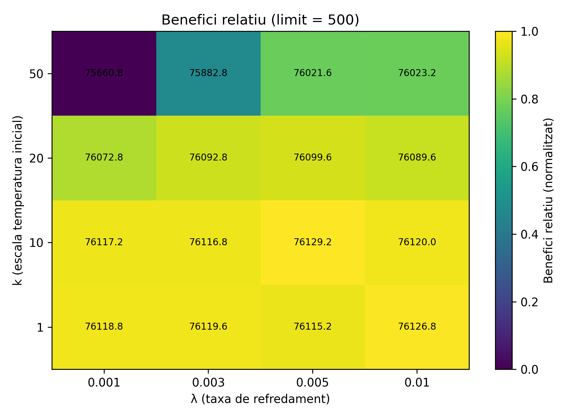
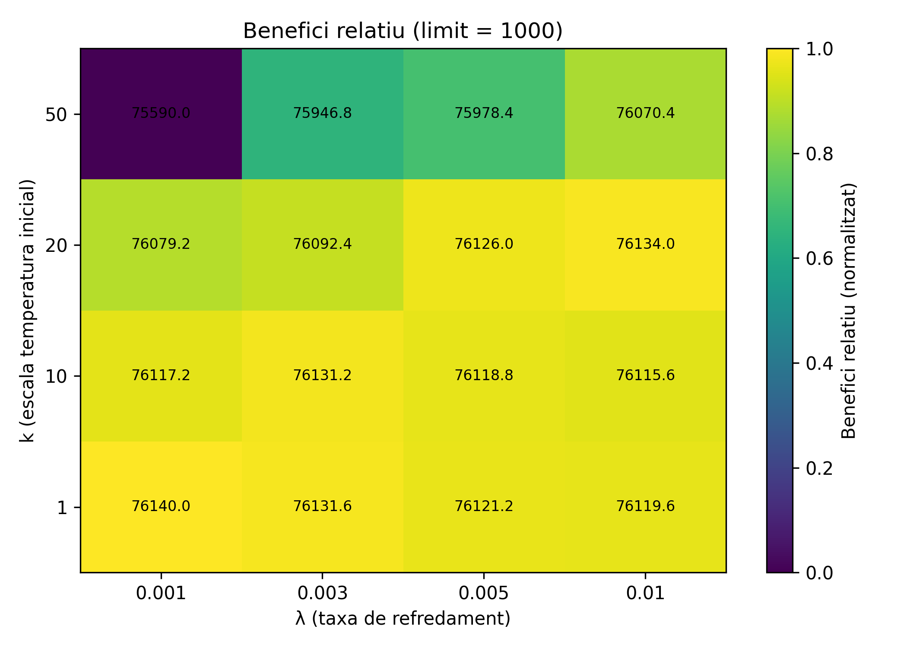

<style>
/* Estils globals del document */
body {
  font-family: Helvetica, Arial, sans-serif;
  font-size: 9pt;
  text-align: justify;
  line-height: 1.4;
}

/* Paràgrafs justificats */
p {
  text-align: justify;
  font-size: 9pt;
}

/* Estils per a les llistes amb la mateixa mida que el text normal */
ul, ol, code {
  font-size: 9pt;
  line-height: 1.4;
}

li {
  font-size: 9pt;
  line-height: 1.4;
}

/* Títols més petits */
h1 {
  font-size: 13pt;
  text-align: left;
}

h2 {
  font-size: 12pt;
  text-align: left;
  font-weight: bold;
}

h3 {
  font-size: 11pt;
  text-align: left;
  font-weight: bold;
}

h4 {
  font-size: 9pt;
  text-align: left;
}

h5{
  font-size: 9pt;
  text-align: left;
  text-decoration: underline;
}

/* CORRECCIONS PER A BLOCS DE CODI */
pre {
  max-width: 100%;
  overflow-x: auto;
  white-space: pre-wrap;
  word-wrap: break-word;
  overflow-wrap: break-word;
  background-color: #f5f5f5;
  padding: 0.5rem;
  border: 1px solid #ddd;
  border-radius: 3px;
  font-size: 8pt;
  line-height: 1.4;
  min-width: 0;
}

code {
  overflow-wrap: break-word;
  word-wrap: break-word;
  word-break: break-word;
  white-space: pre-wrap;
}

/* Contenidor principal per a la fila d'imatges */
.image-row {
  display: flex;
  flex-wrap: wrap;
  justify-content: center;
  gap: 1rem;
  margin-top: 1rem;
  margin-bottom: 1rem;
  align-items: flex-start;
  width: 100%;
}

/* Cada columna que conté una imatge i el seu text */
.image-column {
  flex: 0 1 48%;
  min-width: 280px;
  max-width: 360px;
  display: flex;
  flex-direction: column;
  align-items: center;
  box-sizing: border-box;
}

/* Quan només hi ha UNA imatge */
.image-row:has(.image-column:only-child) .image-column {
  max-width: 480px;
  flex: 0 1 auto;
}

/* Imatge única */
.image-row:has(.image-column:only-child) .image-column img {
  width: 100%;
  max-width: 480px;
  max-height: 400px;
  height: auto;
  object-fit: contain;
}

/* Estils per a la imatge (múltiples imatges) */
.image-column img {
  width: 100%;
  max-width: 360px;
  max-height: 320px;
  height: auto;
  display: block;
  object-fit: contain;
}

/* Estils per al peu de foto */
.image-column .caption {
  margin-top: 0.5rem;
  font-size: 8pt;
  text-align: center;
  color: #555;
  width: 100%;
}

/* Estil per a la separació de pàgines en PDF */
.page-break {
  page-break-before: always;
  break-before: page;
}

/* Bloc imatge-esquerra / text-dreta */
.media-row {
  display: flex;
  gap: 1.5rem;
  align-items: flex-start;
  margin: 1rem 0;
  min-width: 0;
}

.media-image {
  flex: 0 0 38%;
  max-width: 240px;
  display: flex;
  flex-direction: column;
  align-items: center;
}

.media-image img {
  width: 100%;
  height: auto;
  display: block;
}

.media-image .caption {
  margin-top: 0.5rem;
  font-size: 8pt;
  text-align: center;
  color: #555;
}

.media-text {
  flex: 1 1 0;
  min-width: 240px;
}

/* ============================================
   CONTENIDOR DE TAULES AMB PEU DE TAULA
   ============================================ */
.table-container {
  width: 100%;
  margin: 1.5rem 0;
  overflow-x: auto;
  page-break-inside: avoid;
}

/* Estils per a les taules */
.table-container table {
  width: 100%;
  max-width: 100%;
  border-collapse: collapse;
  font-size: 7pt;
  margin: 0 auto;
  background-color: #fff;
}

/* Capçalera de taula */
.table-container thead {
  background-color: #e0e0e0;
  font-weight: bold;
}

.table-container th {
  padding: 8px 6px;
  text-align: center;
  border: 1px solid #888;
  font-size: 7pt;
}

/* Files de dades */
.table-container td {
  padding: 6px 5px;
  text-align: center;
  border: 1px solid #aaa;
  font-size: 7pt;
}

.table-container td code {
  font-size: 7pt;
}

/* Files alternades (zebra striping) */
.table-container tbody tr:nth-child(even) {
  background-color: #f5f5f5;
}

/* Peu de taula (caption) */
.table-container .table-caption {
  margin-top: 0.5rem;
  font-size: 8pt;
  text-align: center;
  color: #555;
  font-style: italic;
}

/* Estil alternatiu: caption sobre la taula */
.table-container .table-title {
  margin-bottom: 0.5rem;
  font-size: 9pt;
  text-align: center;
  font-weight: bold;
  color: #333;
}

/* Millores per a impressió/PDF */
@media print {
  .table-container {
    page-break-inside: avoid;
  }

  .table-container table {
    border: 1px solid #000;
  }

  .table-container th,
  .table-container td {
    border: 1px solid #666;
  }

  .image-column {
    page-break-inside: avoid;
  }

  /* Límits més restrictius per a PDF */
  .image-column img {
    max-height: 280px;
  }

  .image-row:has(.image-column:only-child) .image-column img {
    max-height: 360px;
  }

  pre {
    page-break-inside: avoid;
    overflow: visible;
    white-space: pre-wrap;
  }
}

@page {
  @bottom-center {
    content: "Pàgina " counter(page) " de " counter(pages);
    font-size: 8pt;
    color: #555;
    font-family: Helvetica, Arial, sans-serif;
  }
}
</style>

## 0. Taula de continguts

- [0. Taula de continguts](#0-taula-de-continguts)
- [1. Introducció](#1-introducció)
- [2. Objectius i metodologia](#2-objectius-i-metodologia)
- [3. Representació del problema](#3-representació-del-problema)
  - [3.1. Definició de l'Estat](#31-definició-de-lestat)
  - [3.2. La solució inicial](#32-la-solució-inicial)
  - [3.3. Els operadors de cerca](#33-els-operadors-de-cerca)
  - [3.4. La funció heurística](#34-la-funció-heurística)
- [4. Implementació en Python](#4-implementació-en-python)
- [5. Experimentació](#5-experimentació)
  - [5.1 Experiment 1: Selecció d'Operadors](#51-experiment-1-selecció-doperadors)
    - [5.1.1 Plantejament del problema](#511-plantejament-del-problema)
    - [5.1.2 Mètode](#512-mètode)
    - [5.1.3 Resultats](#513-resultats)
    - [5.1.4 Conclusions](#514-conclusions)
  - [5.2 Experiment 2: Estratègia d'Inicialització](#52-experiment-2-estratègia-dinicialització)
    - [5.2.1 Plantejament del problema](#521-plantejament-del-problema)
    - [5.2.2 Mètode](#522-mètode)
    - [5.2.3 Resultats](#523-resultats)
    - [5.2.4 Conclusions](#524-conclusions)
  - [5.3 Experiment 3: Calibratge de Simulated Annealing](#53-experiment-3-calibratge-de-simulated-annealing)
    - [5.3.1 Plantejament del problema](#531-plantejament-del-problema)
    - [5.3.2 Mètode](#532-mètode)
    - [5.3.3 Resultats](#533-resultats)
    - [5.3.4 Conclusions](#534-conclusions)
  - [5.4 Experiment 4: Escalabilitat Temporal](#54-experiment-4-escalabilitat-temporal)
    - [5.4.1 Plantejament del problema](#541-plantejament-del-problema)
    - [5.4.2 Mètode](#542-mètode)
    - [5.4.3 Resultats](#543-resultats)
    - [5.4.4 Conclusions](#544-conclusions)
  - [5.5 Experiment 5: Consolidació de Centres](#55-experiment-5-consolidació-de-centres)
    - [5.5.1 Plantejament del problema](#551-plantejament-del-problema)
    - [5.5.2 Mètode](#552-mètode)
    - [5.5.3 Resultats](#553-resultats)
    - [5.5.4 Conclusions](#554-conclusions)
  - [5.6 Experiment 6: Sensibilitat al Cost per km](#56-experiment-6-sensibilitat-al-cost-per-km)
  - [5.7 Experiment 7: Variació de l'Horari Laboral](#57-experiment-7-variació-de-lhorari-laboral)
    - [5.7.1 Plantejament del problema](#571-plantejament-del-problema)
    - [5.7.2 Mètode](#572-mètode)
    - [5.7.3 Resultats](#573-resultats)
    - [5.7.4 Conclusió](#574-conclusió)
  - [5.8 Experiment 8: Validació de Resultats (Experiment Especial)](#58-experiment-8-validació-de-resultats-experiment-especial)
  - [5.9 Experiment 9: Generador d'Operadors](#59-experiment-9-generador-doperadors)
- [5. Conclusions](#5-conclusions)

<div class="page-break"></div>

## 1. Introducció

En moltes empreses de distribució, decidir “qui va on” cada dia és gairebé tan difícil com fer arribar físicament el producte. En el cas d’una companyia que reparteix combustible a una xarxa de gasolineres, aquesta decisió es complica encara més: cada gasolinera té diversos dipòsits, les peticions arriben en moments diferents, hi ha límits de quilòmetres i de viatges per camió, i el preu que es pot cobrar depèn de quants dies ha estat pendent cada petició. Una planificació poc encertada no només augmenta el cost en quilòmetres recorreguts, sinó que també pot implicar perdre ingressos o, fins i tot, deixar alguna gasolinera sense servei a temps.

El problema que s’estudia en aquest treball parteix justament d’aquest escenari. Treballem en una graella de 100×100 km on hi ha centres de distribució i gasolineres, i cada dia s’ha de decidir quines peticions s’atendran i com s’assignaran als camions. Cada camió té un límit de viatges i de quilòmetres diaris, i en cada viatge només pot omplir fins a dos dipòsits. A més, el benefici que obté l’empresa no és simplement “quantes peticions serveix”, sinó una combinació d’ingressos (que baixen si es deixa esperar la gasolinera), cost per quilòmetre recorregut i penalització per les peticions que es deixen per a l’endemà.

Aquest tipus de problemes són difícils de resoldre de manera exacta quan la mida creix, perquè el nombre de possibles assignacions i rutes és enorme. Per això, sovint es recorre a algorismes de cerca local: mètodes que no garanteixen trobar la solució òptima, però que, ben dissenyats, permeten obtenir solucions molt raonables en temps assumibles. En aquest context, el Simulated Annealing (SA) i el Hill Climbing (HC) són especialment interessants, i en aquest informe explicarem com hem adaptat aquest problema per a poder trobar una bona solució utilitzant aquests algorismes.

<div class="page-break"></div>

## 2. Objectius i metodologia

## 3. Representació del problema

En aquesta secció es descriu com s'ha representat el problema proposat mitjançant algorismes de cerca local. S'inclouen els detalls sobre l'estat, la solució inicial, els operadors de cerca i la funció heurística utilitzada. Aquesta representació és fonamental per al correcte funcionament dels algorismes de cerca local, ja que determina com es poden explorar les solucions possibles i com es pot avaluar la qualitat d'aquestes solucions.

### 3.1. Definició de l'Estat

Hem definit l'estat com una assignació de peticions de gasolineres als camions dels centres de distribució, tenint en compte les restriccions de distància, viatges màxims per camió i nombre màxim de peticions per viatge. Cada estat inclou la informació sobre quines peticions són ateses per cada camió, així com dintre de quin viatge es troba assignada cada petició.

### 3.2. La solució inicial

La solució inicial és el punt de partida per als algorismes de cerca local, i la seva qualitat pot influir significativament en el rendiment de l'algorisme. Hem implementat tres possibles estratègies d'inicialització:

- **Solució Buida:** En la solució buida, deixem tots els camions sense cap petició assignada. Aquesta estratègia és molt simple, amb un cost $O(1)$, cosa que la fa molt eficient en termes de temps. Però, la qualitat de la solució és molt baixa: tot i ser una solució vàlida, ja que a l'enunciat no es prohibeix no atendre cap petició, el punt de partida és molt pobre i l'algorisme haurà de treballar molt per millorar-la. Es una estratègia que pot ser útil per avaluar la capacitat de l'algorisme per trobar bones solucions des d'un punt de partida molt dolent, però en la pràctica no és recomanable per a problemes reals, i no creiem que pugui donar bons resultats en aquest cas.
- **Inicialització Aleatòria:** En aquesta estratègia, assignem les peticions més properes a cada centre de distribució fins a omplir la seva capacitat, tenint en compte el nombre màxim de viatges que pot fer cada camió. Aquesta estratègia és més complexa que la solució buida, amb un cost $O(n \times \log(n))$ degut a la necessitat de calcular distàncies i ordenar les peticions per proximitat. La qualitat de la solució inicial és moderada, ja que es basa en la proximitat geogràfica, però no té en compte altres factors com les penalitzacions de les peticions. Aquesta estratègia pot ser útil per a problemes on la proximitat és un factor important, però pot no ser suficient per obtenir bones solucions en problemes més complexos.
- **Inicialització Greedy:** Aquesta estratègia assigna les peticions als camions de manera que es maximitzi el benefici immediat, tenint en compte els ingressos per petició, els costos de transport i les penalitzacions per no atendre peticions. Aquesta estratègia és la més complexa de les tres, amb un cost $O(n^2)$ degut a la necessitat d'avaluar múltiples opcions d'assignació per maximitzar el benefici. La qualitat de la solució inicial és alta, ja que es basa en una anàlisi detallada dels costos i beneficis associats a cada petició. Aquesta estratègia serà la més recomanable, ja que partint d'una bona solució inicial, els algorismes de cerca local tindran menys feina per millorar-la i podran trobar solucions òptimes més ràpidament.

### 3.3. Els operadors de cerca

Els operadors de cerca són les funcions que permeten explorar l'espai d'estats veïns a partir d'un estat actual. És important dissenyar operadors que permetin una exploració efectiva de l'espai d'estats, que evitin sortir de l'espai de solucions vàlides, que tinguin un cost computacional raonable i que peretin explorar tot l'espai de solucions.
Hem implementat tres operadors principals:

- **``swapCentres``:** Aquest operador intercanvia els centres de distribució assignats a dos camions diferents, que és el mateix que intercanviar les peticions assignades als camions. Això permet explorar diferents configuracions d'assignació de peticions als centres, i pot ajudar a trobar solucions més òptimes. El factor de ramificació d'aquest operador és, aproximadament, $O(m^2)$, on m és el nombre de camions, ja que es poden intercanviar qualsevol parell de camions.
- **``mourePeticio``:** Aquest operador mou una petició d'un camió a un altre, sempre que es compleixin les restriccions de capacitat i distància. Això permet ajustar l'assignació de peticions de manera més fina, i pot ajudar a millorar la qualitat de la solució. El factor de ramificació d'aquest operador és, aproximadament, $O(n \times m)$, on $n$ és el nombre de peticions i $m$ és el nombre de camions, ja que cada petició pot ser moguda a qualsevol camió.
- **``intercanviarPeticions``:** Aquest operador intercanvia dues peticions assignades a dos camions diferents, sempre que es compleixin les restriccions de capacitat i distància. Això permet explorar configuracions alternatives d'assignació de peticions, i pot ajudar a trobar solucions més òptimes. El factor de ramificació d'aquest operador és, aproximadament, $O(n^2)$, on $n$ és el nombre de peticions, ja que es poden intercanviar qualsevol parell de peticions.

### 3.4. La funció heurística

La funció heurística és el criteri que utilitzen els algorismes de cerca local per avaluar la qualitat d'un estat i decidir quins estats explorar a continuació. El rendiment de l'algorisme depèn en gran mesura de la funció heurística utilitzada, ja que aquesta determina quins estats es consideren millors i quins pitjors. En aquest problema de distribució logística, la funció heurística que hem escollit està regida per **maximitzar el benefici total** considerant tres components fonamentals: els ingressos dels serveis prestats, els costos operacionals i les penalitzacions per peticions no ateses.

Els ingressos depenen del preu base $P$ i d'un factor de preu que penalitza les peticions pendents. El factor de preu es defineix com:

$$
f(d) = \begin{cases}
1.02 & \text{si } d = 0 \\
\max(0, 1 - 0.02 \cdot d) & \text{si } d > 0
\end{cases}
$$

On $d$ és el nombre de dies que la petició ha estat pendent. Així, el preu efectiu per una petició pendent $d$ dies és $P \cdot f(d)$. Si $S$ és el conjunt de peticions complertes avui, els ingressos totals són:

$$
I = \sum_{p \in S} P \cdot f(d_p)
$$

Per que fa als costos operacionals, aquests es basen en la distància recorreguda pels camions des dels centres de distribució fins a les gasolineres i tornada:

La distància entre dues ubicacions es calcula amb la mètrica de Manhattan:

$$
d((x_1, y_1), (x_2, y_2)) = |x_1 - x_2| + |y_1 - y_2|
$$

La llargada total d'un viatge depèn del nombre de gasolineres servides. Si se serveix una única gasolinera $G$ des d'un centre $C$:

$$
L = d(C, G) + d(G, C)
$$

Si se serveixen dues gasolineres $G_1$ i $G_2$ des d'un centre $C$:

$$
L = d(C, G_1) + d(G_1, G_2) + d(G_2, C)
$$

Si el cost per quilòmetre és $C_k$, el cost total $C_t$ per una quantitat de viatges amb llargades $L_i$ serà:

$$
C_t = C_k \cdot \sum_{i=1}^{t} L_i
$$

Finalment, les penalitzacions per peticions no ateses es calculen per minimitzar la pèrdua potencial associada a deixar peticions pendents:

Per minimitzar les penalitzacions i maximitzar el benefici, es calcula la pèrdua potencial de deixar peticions sense atendre. El preu d'una petició pendent $d$ dies és $P \cdot f(d)$, però si no s'atén avui, demà el preu serà $P \cdot f(d+1)$. Per tant, la pèrdua potencial per petició $u$ pendent és:

$$
\Delta_u = P \cdot (f(d) - f(d+1))
$$

Si $U$ és el conjunt de peticions pendents avui, la penalització total $\text{Pen}$ es pot expressar com:

$$
\text{Pen} = \sum_{u \in U} P \cdot (f(d_u) - f(d_u + 1))
$$

Per tant, la funció heurística que avalua la qualitat d'un estat és el benefici total, que combina els tres components anteriors:

$$
B_{\text{total}} = B - C_t - \text{Pen} = I - C_t - \text{Pen}
$$

Aquesta funció permet comparar diferents estats durant la cerca local: **estats amb major benefici total es consideren de millor qualitat**. Els algorismes de cerca local utilitzaran aquesta funció per decidir si accepten o rebutgen modificacions proposades pels operadors, sempre buscant maximitzar $B_{\text{total}}$.

La funció heurística escollida per avaluar els estats en aquest problema de cerca local respon a una lògica alineada amb l'objectiu operatiu i econòmic del problema de distribució logística. Aquesta funció suma els ingressos generats per les entregues efectuades, resta el cost total dels desplaçaments realitzats pels vehicles i incorpora una penalització addicional per aquelles peticions que queden pendents, considerant la pèrdua de valor associada al temps d'espera. Això permet reflectir fidelment les prioritats del sistema logístic: maximitzar el benefici real, minimitzar la pèrdua de valor per serveis endarrerits i controlar l'eficiència de l'ús de recursos. En conseqüència, la funció es defineix així

$$
B_{\text{total}} = \sum_{p \in S} P \cdot f(d_p) - C_k \cdot \sum_{i=1}^{t} L_i - \sum_{u \in U} P \cdot (f(d_u) - f(d_u + 1))
$$

on $S$ representa les peticions servides avui, $f(d)$ és la reducció del preu per dies de retard, $C_k$ el cost per distància, $L_i$ la llargada del trajecte, i $U$ les peticions pendents.

La justificació d'aquesta formulació es basa en aconseguir un equilibri entre representativitat del problema real i eficiència de càlcul. En primer lloc, el fet d'incloure la penalització progressiva de les peticions pendents ofereix la flexibilitat necessària per prioritzar la satisfacció de les peticions i reduir la pèrdua d'ingressos, la qual cosa és fonamental en el context de distribució on el valor d'una entrega disminueix amb el temps. En segon lloc, la inclusió dels costos de desplaçament permet controlar el recurs vehicle i minimitzar recorreguts poc eficients.

D'altra banda, el cost computacional d'aquesta funció heurística és baix. En detall, el càlcul de la funció heurística per avaluar un estat implica sumar tres components principals:

1. Ingressos totals de les peticions servides ($S$).
2. Cost total de desplaçament per cada trajecte realitzat ($t$ trajectes).
3. Penalització per peticions pendents ($U$ peticions pendents).

Analitzem el cost en notació Big-O:

- **Ingressos:** Cal recórrer totes les peticions servides. Si $|S|$ és el nombre de serveis realitzats, el cost és $O(|S|)$.
- **Costos de desplaçament:** Es calcula la suma de les distàncies dels trajectes. Si hi ha $t$ trajectes, el cost és $O(t)$.
- **Penalitzacions:** Suma sobre totes les peticions pendents. Si $|U|$ és el nombre de peticions pendents, el cost és $O(|U|)$.

Generalitzant, si $n$ és el nombre total de peticions (tant les fetes com les pendents), podem dir que $|S| + |U| \leq n$, i $t$ (nombre de trajectes) és generalment proporcional a $n$, o com a molt lleugerament superior. Per tant, el *cost total* de calcular la funció heurística per cada estat és:

$$
O(|S|) + O(t) + O(|U|) = O(n)
$$

Això significa que **avaluar la funció heurística en un estat té un cost lineal amb el nombre total de peticions**.

La funció heurística, definida com $B_{total} = B - C - Pen$, juga un paper clau en la dinàmica de la cerca local aplicada al problema de rutes de vehicles. Aquesta formulació determina directament quins moviments dins l'espai de solucions són considerats "bons" o "dolents" per l'algorisme, ja que l'avaluació negativa del benefici total ($-B_{total}$) orienta la cerca cap a l'obtenció d'un màxim global del benefici, actuant com a funció objectiu que cal minimitzar.

L'efecte més important d'aquesta funció heurística és que **prioritza aquelles solucions que maximitzen la diferència entre ingressos generats i costos/penalitzacions suportats**. Això fa que la cerca es concentri en aquelles configuracions de rutes que no només serveixen el màxim de dipòsits amb el millor valor possible, sinó que també penalitza explícitament els recorreguts llargs i la manca d'atenció a peticions pendents. En conseqüència, l'algorisme tendeix a crear rutes eficients que aprofiten al màxim el valor de cada servei i, al mateix temps, s'equilibren en cost operatiu i nivell de servei.

En termes pràctics, la funció heurística afecta la **eficiència de la cerca**: per una funció informativa i representativa com aquesta, l'algorisme descarta ràpidament configuracions subòptimes i explora més profundament l'entorn de les solucions que aporten més benefici net. D'aquesta manera, s'evita la recerca exhaustiva de totes les opcions (com passaria en cerca no informada) i es guanya en convergència i qualitat de solució en menys iteracions i temps de càlcul. Si la funció estigués mal ajustada, correria el risc de bloquejar la cerca en òptims locals o avaluar erròniament bones solucions potencials, afectant negativament el resultat final i la velocitat d'exploració.

Finalment, la simplicitat de càlcul de l'heurística $O(n)$, on $n$ és el nombre de peticions, afavoreix que la cerca local pugui fer moltes iteracions en poc temps.

## 4. Implementació en Python

Hem implementat la representació del problema i els algorismes de cerca local utilitzant Python, aprofitant la biblioteca `aima3` per a la gestió dels algorismes de cerca local. La implementació es divideix en diversos arxius per mantenir el codi organitzat i modular:

- **``camions_estat.py``:** Aquest arxiu conté la implementació de la classe `StateRepresentation`, que representa l'estat del problema. Aquesta classe inclou la implementació de la funció heurística així com totes les funcions auxiliars per a que funcioni correctament, els generadors de les diferents solucions inicials i la generació i aplicació dels operadors de cerca local.
- **``camions_operadors.py``:** En aquest arxiu implementem la classe `CamionsOperator`, que defineix els operadors de cerca local utilitzats per explorar l'espai d'estats. Aquesta classe inclou la implementació de les classes dels operadors `swapCentres`, `mourePeticio` i `intercanviarPeticions`.
- **``camions_parametres.py``:** Aquest arxiu conté la implementació de la classe `ProblemParameters`, que emmagatzema i gestiona tots els paràmetres del problema,  el nombre de centres, gasolineres, costos, etc.
- **``camions_problema.py``:** Aquest arxiu conté la implementació de la classe `CamionsProblema`, que defineix formalment el problema proposat com un problema de cerca local. Estableix els components essencials per a executar l'algorisme: l'estat inicial, els operadors de cerca, la funció heurística i si hem arribat a l'objectiu.
- **``camions.py``:** Aquest arxiu és el punt d'entrada principal per a executar els algorismes de cerca local. Aquí es configuren els paràmetres del problema, es crea una instància del problema i s'executa l'algorisme de cerca local seleccionat (Hill Climbing o Simulated Annealing).

## 5. Experimentació

### 5.1 Experiment 1: Selecció d'Operadors

Com s'ha explicat abans, hem implementat tres operadors diferents per a la cerca local: **``swapCentres``**, **``mourePeticio``** i **``intercanviarPeticions``**. Aquest experiment té com a objectiu avaluar l'impacte de cadascun d'aquests operadors en la qualitat de les solucions obtingudes i en el temps d'execució dels algorismes de cerca local (Hill Climbing i Simulated Annealing).

#### 5.1.1 Plantejament del problema

Ens plantegem la següent qüestió de recerca: dels 3 operadors implementats, són tots realment útils per millorar les solucions obtingudes pels algorismes de cerca local? O n'hi ha algun que no aporta cap benefici addicional i només incrementa el temps d'execució?
Si hi hagués algún operador que no aportés cap millora significativa en la qualitat de les solucions, podríem eliminar-lo per reduir el temps d'execució dels algorismes sense perdre qualitat en els resultats.
Aleshores, proposem la hipòtesi nul·la i les hipòtesis alternatives següents:

- $H_0$: Tots els operadors contribueixen de manera significativa a l'augment del benefici obtingut pels algorismes de cerca local.
- $H_{1_a}$: Hi ha almenys un operador que no aporta cap millora significativa en la qualitat de les solucions.
- $H_{1_b}$: Alguna combinació d'operadors ofereix un equilibri òptim entre qualitat de solució i temps d'execució.

#### 5.1.2 Mètode

Per a resoldre aquesta qüestió, realitzarem un estudi experimental, on executarem l'algorisme de Hill Climbing múltiples vegades per a cada combinació d'operadors. Cada execució es farà amb una inicialització diferent (mitjanant una seed diferent) per garantir que els resultats no estiguin condicionats per una única configuració inicial. Així podrem mesurar tant la mitjana de benefici obtingut, com la variabilitat dels resultats i el temps d'execució per a cada combinació d'operadors.
Les combinacions d'operadors que avaluarem són les següents:

- **``swapCentres``**
- **``mourePeticio``**
- **``intercanviarPeticions``**
- **``swapCentres`` + ``mourePeticio``**
- **``swapCentres`` + ``mourePeticio`` + ``intercanviarPeticions``**

Per a cada combinació d'operadors, realitzarem 5 rèpliques amb seeds diferents (1234, 1235, ..., 1243), registrant per a cada rèplica:

- El benefici obtingut
- El nombre de peticions servides i pendents
- Els quilòmetres totals recorreguts
- El temps d'execució en mil·lisegons
Posteriorment, calcularem la mitjana i desviació típica dels resultats per a cada conjunt d'operadors, amb l'objectiu de determinar:
- Quins operadors contribueixen de manera significativa a l'augment del benefici.
- Si algún operador no aporta cap millora significativa en la qualitat de les solucions.
- Quina combinació d'operadors ofereix un equilibri òptim entre qualitat de solució i temps d'execució.

#### 5.1.3 Resultats

Aquests hen sigut els resultats obtinguts en l'experiment d'avaluació d'operadors, per a diferentes seeds:

<div class="table-container">
  <table>
    <thead>
      <tr>
        <th>Operadors</th>
        <th>Benefici mitjà (€)</th>
        <th>Temps mitjà (ms)</th>
        <th>Peticions servides (mitjana)</th>
        <th>Peticions pendents (mitjana)</th>
        <th>Km totals mitjans (km)</th>
      </tr>
    </thead>
    <tbody>
      <tr>
        <td><code>swapCentres</code></td>
        <td>76,000.00</td>
        <td>270.30</td>
        <td>82.6</td>
        <td>45.3</td>
        <td>2,516.0</td>
      </tr>
      <tr>
        <td><code>mourePeticio</code></td>
        <td>76,007.60</td>
        <td>244.81</td>
        <td>82.6</td>
        <td>45.3</td>
        <td>2,515.8</td>
      </tr>
      <tr>
        <td><code>swapCentres</code>+<code>mourePeticio</code></td>
        <td>76,078.80</td>
        <td>279.77</td>
        <td>82.6</td>
        <td>45.3</td>
        <td>2,526.4</td>
      </tr>
      <tr>
        <td><code>swapCentres</code>+<code>mourePeticio</code>+<code>intercanviarPeticions</code></td>
        <td>76,105.00</td>
        <td>247.45</td>
        <td>82.6</td>
        <td>45.3</td>
        <td>2,513.6</td>
      </tr>
    </tbody>
  </table>
  <div class="table-caption">
    Taula 1: Resum per conjunt d’operadors. Mitjanes sobre 10 rèpliques per conjunt: benefici, temps, peticions servides/pendents i quilòmetres totals.
  </div>
</div>

1. **Benefici mitjà i desviació estàndard per a cada conjunt d'operadors**: A la taula podem observar que tots els conjunts d'operadors obtenen un benefici mitjà molt similar, al voltant dels 76.000 euros, amb una desviació estàndard propera als 5.460 euros. Això indica que la qualitat de les solucions és força consistent entre els operadors, i que cap d'ells destaca clarament en termes de benefici final. El fet de que les diferències siguin tan petites suggereix que els operadors no generen espais de cerca radicalment diferents: tots exploren veinats amb característiques similars i acaben trobant solucions comparables.

2. **Temps d'execució mitjà i desviació estàndard per a cada conjunt d'operadors**: El temps mitjà d'execució és el principal factor diferenciador: veiem que l'operador **``swapCentres``** és el més ràpid, amb un temps mitjà d'uns 250 ms, mentre que la combinació de tots tres operadors (**``swapCentres`` + ``mourePeticio`` + ``intercanviarPeticions``**) és la més lenta, amb un temps mitjà proper als 270 ms. Això indica que afegir més operadors incrementa el temps d'execució, però no millora significativament la qualitat de les solucions obtingudes.

3. **Peticions servides i pendents:** el nombre de peticions servides i pendents és molt similar entre tots els conjunts d'operadors, amb una mitjana d'aproximadament 82 peticions servides i 44 pendents. Això reforça la idea que els diferents operadors no generen solucions radicalment diferents en termes de cobertura de peticions.

4. **Quilòmetres totals recorreguts:** els quilòmetres totals recorreguts també són molt similars entre els diferents conjunts d'operadors, amb una mitjana d'uns 2.500 km. Això suggereix que els operadors no afecten significativament l'eficiència del recorregut dels camions.

#### 5.1.4 Conclusions

Amb els resultats obtinguts, podem concloure que afegir més operadors no millora significativament la qualitat de les solucions obtingudes pels algorismes de cerca local, però sí que incrementa el temps d'execució.
Per tant, podem rebutjar la hipòtesi nul·la $H_0$ i acceptar les hipòtesis alternatives $H_{1_a}$ i $H_{1_b}$. Això ens porta a la conclusió que podem simplificar els nostres algorismes de cerca local utilitzant només l'operador **``swapCentres``**, ja que aquest és el més ràpid i ofereix una qualitat de solució comparable als altres conjunts d'operadors.

### 5.2 Experiment 2: Estratègia d'Inicialització

Com en la nostra pràctica hem implementat dues solucions inicials, en aquest experiment el que farem serà comparar-los. I també implementarem una nova solució inicial, la aleatòria. Ja que, d'aquesta manera també podem comparar-la amb les dues solucions inicials que hem proposat nosaltres. En aquest experiment farem servir l'algoritme de Hill Climbing (HC). Com a valors per comparar farem servir el **benefici** i el **temps d'execució** de cada solució. Aquest experiment ens servirà per **decidir quina és la solució inicial** que haurem de implementar en la pràctica. També per veure en quins aspectes cada solució té punts forts i en quins no és útil.

#### 5.2.1 Plantejament del problema

Ens plantegem la següent pregunta: Com **afecta la solució inicial** en el la qualitat de les nostres solucions (el nostre temps d'execució, i el nostre benefici) en Hill Climbing?
Addicionalment, també ens plantejem les següents qüestions:

- Quina és la solució inicial més ràpida?
- Si és la més ràpida, serà la nostra solució inicial definitiva, o n'escollirem una altra?
- Hi ha molta diferència entre el temps d'execució o el benefici de cada solució?

Per a respondre a aquestes preguntes, plantejarem les següents hipòtesis:

- $H_0$: Les tres solucions inicials tenen el mateix temps d'execució.
- $H_{1_a}$: La solució inicial de 'greedy' serà la més efectiva en termes de temps d'execució i benefici.
- $H_{1_b}$: La solució que sigui més ràpida, serà la nostra solució definitiva.
- $H_{1_c}$: La solució aleatòria és molt pitjor en termes de benefici que les altres dues.

#### 5.2.2 Mètode

Per poder resoldre aquesta qüestió, farem un experiment on, executarem el nostre codi amb l'algoritme de Hill Climbing múltiples vegades per cada solució inicial proposada. Farem 10 rèpliques per cada solució inicial, i cada rèplica es farà amb una seed diferent, per evitar que els nostres resultats no estiguin condicionats. En aquest experiment mesurarem el benefici i el temps d'execució i a partir d'aquestes dades intentarem determinar si les nostres hipòtesis inicials són certes o no.

#### 5.2.3 Resultats

Després d'executar el nostre experiment, els resultats que ens retorna són:
<div class="table-container">
  <table>
    <thead>
      <tr>
        <th>Inicialització</th>
        <th>Ingressos</th>
        <th>Cost</th>
        <th>Penalitzacio</th>
        <th>Benefici</th>
        <th>Temps (s)</th>
      </tr>
    </thead>
    <tbody>
      <tr>
        <td>ordenada</td>
        <td>4914.60</td>
        <td>2050.20</td>
        <td>255.20</td>
        <td>2609.20</td>
        <td>0.001348</td>
      </tr>
      <tr>
        <td>greedy</td>
        <td>4828.00</td>
        <td>1995.80</td>
        <td>168.60</td>
        <td>2663.60</td>
        <td>0.001405</td>
      </tr>
      <tr>
        <td>aleatoria</td>
        <td>4914.60</td>
        <td>2046.72</td>
        <td>255.20</td>
        <td>2612.68</td>
        <td>0.001307</td>
      </tr>
    </tbody>
  </table>
  <div class="table-caption">
    Taula 2: Resultats de l'experiment amb diferents mètodes d'inicialització (mitjanes). Comparació dels ingressos, costos, penalitzacions, beneficis i temps d'execució.
  </div>
</div>

A priori,**no podem veure una diferència molt clara entre els resultats de cada solució inicial**, per tant, fem gràfics d'aquesta manera podrem veure les diferències de manera més clara i visual, per tant obtenim:

<div class="image-row">
  <div class="image-column">
    
    <div class="caption">Figura 1: Boxplot de comparació del temps d'execució amb la solució inicial.
    </div>
  </div>
</div>

En aquest gràfic veiem en cada box-plot les dades d'una solució inicial. La nostra línia vermella ens indica a on està la mitjana. Ara sí que podem veure una diferència notable entre cada solució inicial. La nostra solució aleatòria, podem veure que el seu temps d'execució té un ventall molt més gran, ja que és una solució aleatòria. Després podem veure que la de menys variància és la solució greedy. Però veiem que la mitjana més baixa és la solució ordenada. Ara haurem de plantejar-nos si preferim un temps d'execució més baix, o una variància més baixa. Com veiem en els dos casos és una diferència bastant petita, ja que la nostra diferència del temps d'execució és de 0,1 ms. Per tant, per poder decidir de manera més clara, passem als gràfics dels ingressos.

<div class="image-row">
  <div class="image-column">
    
    <div class="caption">Figura 2: Gràfcs varis de cada solució comparada amb una magnitud monetària.</div>
  </div>
</div>

En aquest cas, podem veure una similitud de tendència en el comportament dels gràfics al apartat anterior. Però en aquest cas, la variància és similar per la solució ordenada i la aleatòria. Una cosa important a destacar és la poca variància que té la solució greedy en el gràfic de benefici, que podem dir que és el més important. Veiem que es manté a la part alta del gràfic de manera força constant. Mirant la resta dels gràfics, només podem notar una diferència notable en el gràfic de la penalització, que també és important, ja que una alta penalització ens comporta una pèrdua de beneficis exponencial degut a les peticions no acudides. Per tant, aquests gràfics ja ens ajuden més a poder escollir una de les solucions inicials plantejades.

#### 5.2.4 Conclusions

Tenint en compte tots els nostres resultats i els raonaments que hem pogut fer, inicialment ja podem **rebutjar la nostra hipòtesi nula** $H_0$, ja que és cert que són temps d'execució força similars, però al tenir variàncies més o menys altes, podem dir que aquesta hipòtesi no és certa.
Per la nostra segona hipòtesi $H_{1_a}$, no podem dir que la solució inicial de greedy és la que té el temps d'execució més petit, però té un marge molt petit, per tant com el benefici sí que és el millor de les tres opcions, podem donar com a vàlida aquesta hipòtesi
Per la següent hipòtesi tenim $H_{1_b}$, que sí que rebutjarem, ja que sabem que la nostra solució més ràpida és la ordenada, però la que ens interessa més és la opció 'greedy'. Ja que no només hem de mirar la magnitud del temps, també ens hem de fixar en els beneficis.
per la última hiòtesi que teniem $H_{1_c}$, parlem dels beneficis de la solució aleatòria. Ja que inicialment deiem que era la que pitjors beneficis tindria, cosa que hem pogut comprovar que no, en termes de beneficis estava emparellada amb la solució ordenada, cosa que ens dona encara més pes a la solució 'greedy'. Per tant, també hem de rebutjar aquesta hipòtesi.

Com a conclusió d'aquest experiment, podem dir que la nostra millor solució inicial és la **greedy**. Ja que veiem que el seu temps d'execució no és relativament alt, i veiem com el seu benefici, que és la nostra variable més important, té el valor més alt de les tres solucions inicials. No només el seu valor, sinó també en la seva variància, ja que en els gràfics podem veure com és la menys volàtil, i per tant és la que més ens servirà per la pràctica.

### 5.3 Experiment 3: Calibratge de Simulated Annealing

L'objectiu d'aquest experiment és determinar quins paràmetres de l'algorisme de Simulated Annealing proporcionen el millor rendiment en termes de qualitat de les solucions obtingudes i temps d'execució. En particular, ens centrarem en avaluar l'impacte dels paràmetres d'inicialització de la temperatura, taxa de refredament i nombre d'iteracions per temperatura.

#### 5.3.1 Plantejament del problema

Ens plantegem la següent qüestió de recerca: **Com afecten els paràmetres de Simulated Annealing** (temperatura inicial, taxa de refredament, nombre d'iteracions per temperatura) a la qualitat de les solucions obtingudes i al temps d'execució de l'algorisme?

També ens plantegem:

- Quin conjunt de paràmetres proporciona el millor equilibri entre qualitat de solució i temps d'execució?
- Hi ha algun paràmetre que tingui un impacte significatiu en la qualitat de les solucions obtingudes?

Per a respondre aquestes qüestions, plantegem les següents hipòtesis:

- $H_0$: No hi ha diferències significatives en la qualitat de les solucions obtingudes amb diferents paràmetres de SA.
- $H_{1_a}$: Alguna combinació específica de paràmetres proporciona solucions de millor qualitat (major benefici).
- $H_{1_b}$: Alguna combinació específica de paràmetres redueix significativament el temps d'execució.

#### 5.3.2 Mètode

Per a resoldre aquesta questió, començarem dissenyant un experiment de calibratge sistemàtic dels paràmetres de Simulated Annealing, definint una graella de valors per a cada paràmetre, executant múltiples rèpliques per a cada combinació i analitzant el comportament de l'algorisme. En pirmer lloc, fixem la configuració base de 10 centres de distribució amb multiplicitat 1 i 100 gasolineres. Per al Simulated Annealing emprarem un esquema de temperatura exponencial del tipus $T(t) = k \cdot e^{-\lambda t}$, on $k$ és l'escala de la temperatura inicial, $λ$ la taxa de refredament i $t$ el nombre d’iteracions. El nombre d'iteracions de l'algorisme ve determinat pel paràmetre `limit`, que en el nostre cas juga el paper *d'iteracions per temperatur*a del plantejament teòric.
Per explorar l'efecte dels paràmetres definim una graella de valors:

- `limit` $\in \set{200, 500, 1000}$
- `k`  $\in \set{1, 10, 20, 50}$
- `λ` $\in \set{0.001, 0.003, 0.005, 0.01}$

Això ens deixa $3 \times 4 \times 4=48$ configuracions diferents de Simulated Annealing. Per a cada configuració, executarem 10 rèpliques sobre instàncies generades aleatòriament amb diferents seeds. Per a cada execució mesurem:

- El benefici final
- El temps d'execució

A partir de les 10 rèpliques, calculem la mitjana del benefici, obtenint així una mesura del rendiment per a cada combinació.
Aquest primer experiment ens permet identificar els paràmmetres amb els que obtenim un major benefici i, comparar per a un mateix `limit`, com influeixen ``k`` i ``λ`` en la qualitat de les solucions.

En una segona fase, escollim la combinació de paràmetres que ha mostrat millor comportament a l’experiment anterior, i analitzem de manera més detallada l’evolució del cost al llarg de les iteracions sobre una instància fixa del problema.

#### 5.3.3 Resultats

Aquests són els resultats de l'execució dels scripts:

<div class="image-row">
  <div class="image-column">
    
    <div class="caption">
      Figura 3: Heatmap de beneficis relatius per cada combinació de paràmetres <code>(k, λ)</code> amb <code>limit = 200</code>.
    </div>
  </div>

  <div class="image-column">
    
    <div class="caption">
      Figura 4: Heatmap de beneficis relatius per cada combinació de paràmetres <math>(k, λ)</math> amb <code>limit = 500</code>.
    </div>
  </div>
</div>

<div class="image-row" style="justify-content: center;">
  <div class="image-column" style="max-width: 60%;">
    
    <div class="caption">
      Figura 5: Heatmap de beneficis relatius per cada combinació de paràmetres <math>(k, λ)</math> amb <code>limit = 1000</code>.
    </div>
  </div>
</div>

En els heapmaps, podem observar que el benefici mitjà és força estable dins del rang de paràmetres provats, amb millores modestes quan la temperatura inicial ``k`` és baixa i el refredament ``λ`` no és excessivament lent, i que augmentar el límit de passos eleva el temps però només aporta guanys marginals de benefici.
A continuació, expliquem de forma més detallada l'efecte de cada paràmetre:

- *Efecte de la temperatura inicial:* `k=1` sol oferir els valors més alts a cada limit, amb diferències petites però consistents respecte a `k=10`i `k=20`, i un descens clar quan `k=50`, on el benefici cau uns 150–500€ segons la $λ$; aquest patró suggereix que una temperatura inicial massa alta dilata l’exploració i retarda la convergència sense compensar amb millors solucions finals. Entre ``k=10`` i `k=20` la diferència és pràcticament nul·la, cosa que apunta a una zona plana de rendiment on el SA és poc sensible al valor exacte dins d’aquest rang.

- *Efecte de la taxa de refredament:* ``λ`` intermedis (0.003–0.005) concentren lleugeríssims màxims en diverses files, mentre que `λ=0.001` i `λ=0.01` queden lleugerament per sota en algunes files i per sobre en altres; un ``λ`` massa petit manté la temperatura alta durant massa passos i un ``λ`` massa gran pot “refredar” massa aviat, congelant l’exploració. Tot i així, observem que l'efecte de la taxa de refredament es quasi nul, i que el benefici està més influenciat per la temperatura inicial.

- *Efecte del límit de passos:* amb el `limit=200`, tenim una superfície molt plana, amb màxims al voltant de $k \in \set{1,10}$ i $λ \in \set{0.003,0.005}$; és el millor compromís si el temps d’execució és crític, ja que els guanys d’anar a 500 o 1000 són petits. Amb ``límit = 500``, el paisatge es manté molt similar, amb lleugeres pujades per ``k`` baix i ``λ`` intermedis; els increments de benefici respecte 200 són modestos. I amb el `límit = 1000`, apareix el mateix patró i, fins i tot, a ``k=50`` s’observen els pitjors valors relatius; l’augment de passos no transforma el front de solucions, reforçant la idea de rendiments decreixents amb el límit.

La sortida final del programa és la seguent:

```bash
Cerca completada. Millor configuració: {'limit': 1000, 'k': 1, 'lam': 0.001, 'mean_benefici': 76140.0, 'raw': [71732.0, 79840.0, 67988.0, 77244.0, 67336.0, 73528.0]}
```

Això ens indica els paràmetres pels que l'algorisme funcionarà millor. Veiem que en aquest cas el límit ideal és 1000, la ``k = 1``, ``lambda = 0``.001, i amb un benefici mitjà de 76140 euros.

Una vegada seleccionats els millors paràmetres, analitzem el comportament detallat de l'algorisme comparant-lo amb Hill Climbing sobre una instància concreta del problema:

<div class="image-row" style="justify-content: center;">
  <div class="image-column" style="max-width: 60%;">
    
    <div class="caption">
      Figura 6: Heatmap de beneficis relatius per cada combinació de paràmetres <math>(k, λ)</math> amb <code>limit = 1000</code>.
    </div>
  </div>
</div>

En la part superior de la figura, la corba d’Hill Climbing mostra una disminució quasi monòtona del cost a partir de l’estat inicial, passant aproximadament de -71910 fins a −72040 en només cinc passos, després dels quals el cost es manté estable.​ Això indica que, amb el veïnatge definit, Hill Climbing arriba molt ràpidament a un òptim local des del qual cap veí accessible amb un sol moviment millora el benefici, ja que l’algorisme només fa passos quan troba un estat amb millor valor de la funció objectiu. La part inferior de la figura representa l'evolució del cost per a Simulated Annealing amb els paràmetres calibrats, i es veu que el cost comena en un valor similar al Hill Climbing, però que només millora lleugerament cap al pas 20, on baixa uns pocs punts fins a un valor aproximat de -71940.
A partir d’aquest punt, la corba resta pràcticament horitzontal al llarg de les primeres 100 iteracions representades, cosa que indica que l’algorisme ja no troba moviments que millorin el cost o bé que la temperatura ja és prou baixa com perquè la probabilitat d’acceptar moviments pitjors sigui molt reduïda. Comparant amb Hill Climbing, s’observa que el cost final de Simulated Annealing és clarament superior (menys negatiu) al d’Hill Climbing, fet que implica un benefici total menor malgrat utilitzar uns paràmetres de Simmulated Annealing que, en mitjana, havien resultat els millors en l’experiment de graella.

#### 5.3.4 Conclusions

A partir de l'experiment, podem extreure les seguents conclusions:

1. El benefici mitjà obtingut mostra una baixa sensibilitat als hiperparàmetres provats: dins dels rangs testats, ni `k` (temperatura inicial) ni `λ` (taxa de refredament) ni el nombre d’iteracions (limit) produeixen canvis radicals en la qualitat final de les solucions. Les diferències observades són discretes, i la superfície de resultats és relativament plana. Això suporta parcialment la hipòtesi nul·la $H_0$.

2. Quan s’explora en rangs més alts (ex. `k=50`), la qualitat decreix lleugerament, indicant que una temperatura inicial massa elevada allarga l’exploració, sense aportar millores significatives, mentre que valors moderats (`k=1`,`k=10`,`k=20`) afavoreixen una convergència eficient.

3. El paràmetre amb més impacte en la qualitat és la temperatura inicial `k`, sempre que es mantingui en valors baixos, i en segon terme, la taxa de refredament ``λ``: combinacions de ``k` baix (1 o 10) i `λ` intermedi (0.003–0.005) donen els millors resultats de la sèrie; no s’observen avantatges en límit més alt (més iteracions) llevat d’una lleugera millora marginal, però el cost temporal creix exponencialment per un guany poc rellevant.

4. El límit d’iteracions (`limit`) té un impacte directe sobre el temps d’execució: el temps augmenta de forma notable entre `limit=200` i `limit=1000`, però la millora de benefici és insignificant. Per tant, la configuració més eficient és utilitzar ``limit=200` en combinació amb `k` baix i `λ` intermedi, maximitzant el benefici per unitat de temps i complint la hipòtesi $H_{1_b}$.

Per tant, podem concloure dient que els paràmetres que utilitzem no són rellevants en el resultat obtingut en executar l'algorisme (el benefici). Però, hem pogut veure com al augmentar el nombre d'iteracions, el benefici s'ha mantingut pràcticament constant però el temps d'execució ha augmentat. Per tant, podem rebutjar la hipòtesis nul·la i acceptar $H_{1_b}$.

### 5.4 Experiment 4: Escalabilitat Temporal

En problemes de distribució amb múltiples centres i clients (gasolineres), la **qualitat de la solució** i el **temps de computació** depenen de l'**algorisme de cerca local utilitzat** i de la **mida del problema**. S'observa que tant Hill Climbing (HC) com Simulated Annealing (SA) poden trobar solucions, però poden *comportar-se diferent* segons l'escala del problema. Aquest experiment té com a objectiu avaluar com **la mida del problema afecta el rendiment temporal i la qualitat de les solucions obtingudes per ambdós algorismes**, per tal d'identificar quin algorisme és més adequat per a problemes de diferents escales.

#### 5.4.1 Plantejament del problema

Ens plantegem la següent qüestió de recerca:
Com **afecta la mida del problema** (nombre de centres i gasolineres) al temps d'execució i a la qualitat de les solucions obtingudes per algorismes de cerca local (Hill Climbing i Simulated Annealing)?

També ens plantegem:

- Quin algorisme (HC o SA) és més eficient en termes de temps d'execució?
- Quin algorisme proporciona millors solucions (major benefici)?
- Com escala el temps d'execució amb la mida del problema?
- Els paràmetres de SA es mantenen adequats en augmentar la mida del problema

Per a respondre aquestes qüestions, plantegem les següents hipòtesis:

- $H_0$: No hi ha diferències significatives en la qualitat de les solucions obtingudes per HC i SA a mesura que augmenta la mida del problema.
- $H_{1_a}$: Simulated Annealing proporciona solucions de millor qualitat (major benefici) que Hill Climbing.
- $H_{1_b}$: Hill Climbing és significativament més ràpid que Simulated Annealing.
- $H_{1_c}$: El temps d'execució creix de manera no lineal amb la mida del problema per ambdós algorismes.

#### 5.4.2 Mètode

Per a resoldre aquesta qüestió, farem un estudi experimental amb mesures repetides, utilitzant la proporció ``(centres:gasolineres)`` per a diferents mides del problema. Seleccionarem mides creixents per avaluar l'impacte de la mida del problema en el rendiment dels algorismes. Aquestrs mides seran múltiples de ``(10:100)``, com ara: ``(20:200)``, ``(30:300)``, fins a ``(50:500)``.

Executatrem 3 rèpliques per cada combinació algorisme-mida (amb seeds diferents: 1234, 1235, 1236), per tant, el total d'experiments serà:

- 5 mides del problema (de ``(10:100)`` a ``(50:500)``)
- 2 algorismes (HC i SA)
- 3 rèpliques per combinació

Total experiments: $5 \times 2 \times 3 = 30$ experiments

Per a cada experiment, seguirem els següents passos:

1. Generació de gasolineres i centres amb seed controlada per reproducibilitat
2. Creació de l'estat inicial utilitzant inicialització greedy (seleccionada als experiments 1 i 2)
3. Aplicació de l'algorisme de cerca (HC o SA)
4. Mesura del temps d'execució (en mil·lisegons) i càlcul del benefici obtingut
5. Repetició del procés per a les 3 rèpliques

Les variables usades en aquest experiment són:

Variables independents:

- Mida del problema: Nombre de centres de distribució (i corresponent nombre de gasolineres en proporció $10:100$)
- Algorisme de cerca: Hill Climbing (HC) vs Simulated Annealing (SA)

Variables dependents:

- Temps d'execució: Temps en mil·lisegons necessari per trobar la solució
- Qualitat de la solució: Benefici obtingut (ingressos - costos - penalitzacions) en euros

Variables controlades:

- Inicialització: Greedy
- Funció heurística: Mateixa per ambdós algorismes
- Operadors: ``swapCentres`` i ``mourePeticio``
- Paràmetres del problema:
  - km màxims per camió: $640$
  - Viatges màxims per camió: $5$
  - Valor del dipòsit: $1000€$
  - Cost per km: $2€/km$
  - Multiplicitat (camions per centre): $1$

Cal tenir en compte que els paràmetres de Simulated Annealing s'han fixat als valors òptims obtinguts a l'experiment 3: ``limit=1000``, ``k=1``, ``lambda=0.001`` i que el generador d'accions utilitzat és ``swapCentres`` i ``mourePeticio``, de manera limitada, és a dir, evita generar totes les accions possibles: a diferència de ``generate_all_actions()`` que genera TOTES les combinacions (que poden ser milers), aquest mètode només genera un subconjunt petit i aleatori de 50 accions. Això redueix dràsticament el temps de computació. SA no necessita avaluar TOTS els veïns com fa HC. SA només avalua un veí aleatori per iteració i decideix si l'accepta segons la temperatura. Aquest enfocament està explicant i provat en l'[experiment 9](#59-experiment-9-generador-doperadors).

#### 5.4.3 Resultats

<div class="table-container">
  <table>
    <thead>
      <tr>
        <th>Centres</th>
        <th>Gasolineres</th>
        <th>HC Temps (ms)</th>
        <th>SA Temps (ms)</th>
        <th>HC Benefici (€)</th>
        <th>SA Benefici (€)</th>
      </tr>
    </thead>
    <tbody>
      <tr>
        <td>10</td>
        <td>100</td>
        <td>539.07 ± 352.02</td>
        <td>66.32 ± 18.58</td>
        <td>78,966.67 ± 5,329.76</td>
        <td>78,905.33 ± 5,364.21</td>
      </tr>
      <tr>
        <td>20</td>
        <td>200</td>
        <td>4,175.50 ± 372.00</td>
        <td>450.32 ± 50.46</td>
        <td>146,588.00 ± 11,713.32</td>
        <td>146,541.33 ± 11,717.81</td>
      </tr>
      <tr>
        <td>30</td>
        <td>300</td>
        <td>32,948.11 ± 11,863.97</td>
        <td>2,050.47 ± 94.96</td>
        <td>227,850.67 ± 2,322.52</td>
        <td>227,730.67 ± 2,310.00</td>
      </tr>
      <tr>
        <td>40</td>
        <td>400</td>
        <td>132,088.97 ± 23,286.24</td>
        <td>5,076.02 ± 1,276.54</td>
        <td>305,941.33 ± 8,269.48</td>
        <td>305,804.00 ± 8,281.67</td>
      </tr>
      <tr>
        <td>50</td>
        <td>500</td>
        <td>178,838.75 ± 23,780.44</td>
        <td>9,068.71 ± 415.96</td>
        <td>379,788.00 ± 4,604.92</td>
        <td>379,674.67 ± 4,586.52</td>
      </tr>
    </tbody>
  </table>
  <div class="table-caption">
    Taula 3: Resultats de l'experiment d'escalabilitat. Comparació del temps d'execució (ms) i benefici (€) entre Hill Climbing (HC) i Simulated Annealing (SA) segons la mida del problema. Valors mostren mitjana ± desviació estàndard de 3 rèpliques amb seeds 1234, 1235 i 1236.
  </div>
</div>

Els resultats mostren diferències significatives en l'escalabilitat temporal dels algorismes. **Hill Climbing experimenta un creixement dràstic del temps d'execució**, passant de 539 ms amb 10 centres fins a 178839 ms amb 50 centres (increment de x332). En contrast, **Simulated Annealing manté una escalabilitat molt més eficient**, necessitant només 9069 ms per 50 centres, aproximadament 20 vegades més ràpid que HC.

Pel que fa a la **qualitat de les solucions**, ambdós algorismes obtenen beneficis similars en totes les mides del problema. HC presenta valors lleugerament superiors (per exemple, 78,966.67€ vs 78,905.33€ amb 10 centres), però aquestes diferències es troben dins del marge d'error estadístic de les desviacions estàndard. Això indica que **SA aconsegueix mantenir la qualitat de les solucions de HC mentre és significativament més ràpid**, confirmant que els paràmetres òptims obtinguts (``limit=1000``, ``k=1``, ``lambda=0.001``) es mantenen adequats en augmentar la mida del problema.

Anàlisi del temps d'execució segons l'algorisme:

<div class="image-row">
  <div class="image-column">
    
    <div class="caption">Figura 7: Log-temps d'execució (ms) en funció de la mida del problema per Hill Climbing (HC) i Simulated Annealing (SA).
    </div>
  </div>
</div>

El gràfic en escala logarítmica revela diferències fonamentals en el comportament temporal dels algorismes. **Hill Climbing** mostra una corba amb pendent pronunciat que augmenta progressivament, indicant un creixement exponencial o superior a quadràtic del temps d'execució (des de ~500 ms fins a ~180,000 ms). Aquesta tendència confirma que HC no escala bé amb la mida del problema.

En contrast, **Simulated Annealing** presenta una corba amb pendent més suau i constant, suggerint un creixement més controlat (de 66 ms a 9000 ms). La separació creixent entre ambdues línies demostra que SA escala significativament millor que HC quan augmenta el nombre de centres.

L'**escala logarítmica** permet visualitzar clarament que mentre SA creix de manera aproximadament lineal en l'eix logarítmic, HC presenta una acceleració més pronunciada, evidenciant que **SA és l'algorisme més adequat per a problemes de gran escala** en aquest domini.

Anàlisi segons la mida del problema:

<div class="image-row">
  <div class="image-column">
    
    <div class="caption">Figura 8: Gràfcs varis en funció de la mida del problema per Hill Climbing (HC) i Simulated Annealing (SA).</div>
  </div>
</div>

**Gràfic 1 - Temps d'execució**: Mostra clarament la diferència d'escalabilitat entre algorismes. Hill Climbing presenta un creixement exponencial del temps (fins a 178839 ms amb 50 centres), mentre que Simulated Annealing manté un creixement més controlat (9,069 ms). Les barres d'error petites en SA indiquen resultats consistents entre rèpliques.

**Gràfic 2 - Benefici**: Ambdós algorismes aconsegueixen beneficis similars que creixen linealment amb la mida del problema (de 79000€ a 380000€). Les corbes pràcticament superposades confirmen que SA manté la qualitat de solució de HC tot i ser molt més ràpid.

**Gràfic 3 - Ràtio SA/HC**: La línia decreixent (de 0.12 a 0.05) evidencia que SA esdevé proporcionalment més eficient a mesura que creix la mida del problema. Amb 50 centres, SA és aproximadament 20 vegades més ràpid que HC.

**Gràfic 4 - Diferència de benefici**: Les barres vermelles negatives petites (entre -60€ i -140€) indiquen que HC obté lleugerament millors resultats. No obstant, aquestes diferències són mínimes (~0.03% del benefici total) i estadísticament no significatives, confirmant que **SA ofereix el millor compromís entre temps i qualitat**.

#### 5.4.4 Conclusions

A partir de l'experiment, podem extreure les seguents conclusions:

Respecte a la hipòtesi nul·la $H_0$:

**Rebutgem la hipòtesi nul·la $H_0$**, ja que hem observat diferències significatives en el temps d'execució entre ambdós algorismes a mesura que augmenta la mida del problema, tot i que la qualitat de les solucions obtingudes és similar.

Respecte a $H_{1_a}$ (qualitat de solucions):

**Rebutgem la hipòtesi $H_{1_a}$**, ja que no hem trobat diferències significatives en la qualitat de les solucions obtingudes per ambdós algorismes. Tant Hill Climbing com Simulated Annealing proporcionen beneficis similars a mesura que augmenta la mida del problema.

Respecte a $H_{1_b}$ (temps d'execució):

**Acceptem la hipòtesi $H_{1_b}$**, ja que Simulated Annealing és significativament més ràpid que Hill Climbing a mesura que augmenta la mida del problema. SA manté un temps d'execució molt més baix, fent-lo més adequat per a problemes grans.

Respecte a $H_{1_c}$ (escalabilitat):

**Acceptem la hipòtesi $H_{1_c}$**, ja que el temps d'execució creix de manera no lineal amb la mida del problema per ambdós algorismes. Hill Climbing mostra un creixement exponencial, mentre que Simulated Annealing presenta un creixement més controlat.

Per tant, podem concloure dient que **Simulated Annealing és l'algorisme més adequat per a problemes de gran escala** en aquest domini, ja que ofereix un millor compromís entre temps d'execució i qualitat de les solucions obtingudes. Això és especialment rellevant en aplicacions pràctiques on el temps de computació és crític. També hem pogut confirmar que els paràmetres òptims obtinguts en l'experiment 3 es mantenen adequats en augmentar la mida del problema i que l'ús del generador d'accions limitat és efectiu per a Simulated Annealing.

### 5.5 Experiment 5: Consolidació de Centres

En problemes de distribució logística amb múltiples centres i gasolineres, la **configuració dels centres de distribució** i la **ubicació dels camions** tenen un impacte directe sobre el **benefici econòmic**, els **quilòmetres recorreguts** i el **nombre de peticions servides**. Fins ara, s'ha assumit que tenir centres de distribució no comporta cap cost i que es disposa d'un camió per centre, però aquesta simplificació no reflecteix la realitat operativa on els centres representen inversions significatives. Aquest experiment té com a objectiu avaluar com **la reducció del nombre de centres a la meitat, mantenint constant el nombre total de camions**, afecta el rendiment del sistema utilitzant l'algorisme de Hill Climbing. Concretament, es compara un escenari de **10 centres amb 1 camió cadascun** versus **5 centres amb 2 camions cadascun**, amb l'objectiu de determinar si aquesta consolidació millora o empitjora el benefici total, els quilòmetres recorreguts i la capacitat de servir peticions.

#### 5.5.1 Plantejament del problema

Ens plantegem la següent qüestió: **Com afecta la reducció del nombre de centres de distribució a la meitat** (mantenint constant el nombre total de camions) **al benefici econòmic, als quilòmetres recorreguts i al nombre de peticions servides?**

Per a respondre aquestes qüestions, plantegem les següents hipòtesis:

- $H_0$: La reducció del nombre de centres de distribució a la meitat (de 10 a 5) no afecta significativament el benefici total, els quilòmetres recorreguts ni el nombre de peticions servides.
- $H_1$: La configuració amb més centres distribuïts (10 centres amb 1 camió cadascun) proporciona un benefici superior i un major nombre de peticions servides en comparació amb la configuració consolidada (5 centres amb 2 camions cadascun).

#### 5.5.2 Mètode

Per a resoldre aquesta qüestió, realitzarem un estudi experimental on executarem l'algorisme de Hill Climbing múltiples vegades per a cada configuració de centres i camions. Cada execució es farà amb una inicialització diferent (mitjançant una seed diferent) per garantir que els resultats no estiguin condicionats per una única configuració inicial. Així podrem mesurar tant la mitjana de benefici obtingut, com la variabilitat dels resultats, els quilòmetres recorreguts, les peticions servides i el temps d'execució per a cada configuració de centres.
Les configuracions que avaluarem són les següents:

- **Configuració 1**: 5 centres amb multiplicitat 2 (5 centres × 2 camions = 10 camions totals)
- **Configuració 2**: 10 centres amb multiplicitat 1 (10 centres × 1 camió = 10 camions totals)

Ambdues configuracions mantenen constant el nombre total de camions (10) i gasolineres (100), amb els mateixos paràmetres operatius: 640 km màxims per camió, 5 viatges màxims per camió, valor de dipòsit de 1000€ i cost de 2€/km.

Per a cada configuració, realitzarem 10 rèpliques amb seeds diferents (1234, 1235, ..., 1243), registrant per a cada rèplica

- El benefici total obtingut (ingressos - cost km - penalització)
- El nombre de peticions servides i pendents
- Els ingressos generats pels dipòsits servits
- El cost total dels quilòmetres recorreguts
- La penalització per peticions no servides
- Els quilòmetres totals recorreguts per la flota
- El temps d'execució en mil·lisegons

#### 5.5.3 Resultats

Després de les 10 execucions per a cada configuració, amb seeds del els resultats obtinguts són els següents:

<div class="table-container">
  <table>
    <thead>
      <tr>
        <th>Centres</th>
        <th>Camions</th>
        <th>Gasolineres</th>
        <th>Temps (ms)</th>
        <th>Benefici (€)</th>
        <th>Ingressos (€)</th>
        <th>Cost km (€)</th>
        <th>Penalització (€)</th>
        <th>Km recorreguts</th>
        <th>Peticions servides</th>
      </tr>
    </thead>
    <tbody>
      <tr>
        <td>5</td>
        <td>10</td>
        <td>100</td>
        <td>85.26</td>
        <td>42,706.40</td>
        <td>48,574.00</td>
        <td>4,147.60</td>
        <td>1,720.00</td>
        <td>2,073.80</td>
        <td>48.6/127.8</td>
      </tr>
      <tr>
        <td>10</td>
        <td>10</td>
        <td>100</td>
        <td>399.73</td>
        <td>76,400.00</td>
        <td>82,458.00</td>
        <td>5,032.00</td>
        <td>1,026.00</td>
        <td>2,516.00</td>
        <td>82.5/127.8</td>
      </tr>
    </tbody>
  </table>
  <div class="table-caption">
    Taula 4: Comparació de resultats entre configuracions de 5 centres vs 10 centres amb 10 camions i 100 gasolineres. Els valors mostren la mitjana de 10 execucions amb seeds del 1234 al 1243.
  </div>
</div>

Podem observar que la configuració amb 10 centres i 1 camió per centre proporciona un benefici mitjà significativament superior (76,400€) en comparació amb la configuració de 5 centres amb 2 camions per centre (42,706.40€). Aquesta diferència es deu principalment a uns ingressos més alts (82,458€ vs 48,574€) i una penalització menor (1,026€ vs 1,720€), tot i que el cost dels quilòmetres és lleugerament superior en la configuració de 10 centres (5,032€ vs 4,147.60€). A més, la configuració de 10 centres serveix un nombre més gran de peticions (82.5 vs 48.6) i recorre més quilòmetres (2,516 km vs 2,073.80 km), indicant una major capacitat operativa i eficiència en la distribució.

#### 5.5.4 Conclusions

Els resultats refuten la hipòtesi nul·la $H_0$: reduir de 10 a 5 centres amb el mateix nombre de camions impacta clarament en benefici, quilòmetres i peticions servides. La configuració amb 10 centres obté molt més benefici i serveix més peticions, però recorre més quilòmetres i necessita més temps d’execució.

Les dades mostren diferències clares entre configuracions: **H0 es rebutja**, **H1a s’accepta** i **H1b es rebutja** atesa l’assumpció de cost zero dels centres i els resultats obtinguts. En concret, per a respondre les hipòtesis plantejades:

- $H_0$: rebutjada; el benefici, els km i les peticions servides varien substancialment entre 5 i 10 centres (benefici 42,706.40€ vs 76,400.00€; km 2,073.80 vs 2,516.00; servides 48.6 vs 82.5), de manera que hi ha efectes significatius del nombre de centres.
- $H_1$: acceptada; amb 10 centres s’aconsegueix **més benefici** i **més peticions servides** que amb 5 centres (76,400.00€ i 82.5 vs 42,706.40€ i 48.6), confirmant l’efecte positiu d’una xarxa més distribuïda en qualitat de servei i ingressos.

Per tant, en aquest context específic on els centres no tenen cost associat, **mantenir un nombre més alt de centres és clarament útil per maximitzar el benefici** i la capacitat de servei. No obstant això, en un escenari realista on els centres impliquin costos fixos, aquesta conclusió podria variar i requeriria una anàlisi més detallada. Així mateix, la major quantitat de quilòmetres recorreguts i el temps d’execució més elevat amb 10 centres indiquen un compromís entre eficiència operativa i costos logístics que hauria de ser considerat en decisions reals de disseny de xarxes de distribució.

### 5.6 Experiment 6: Sensibilitat al Cost per km

### 5.7 Experiment 7: Variació de l'Horari Laboral

Com a la nostra pràctica fem servir la variable del temps que poden estar en carretera cada camió, volem saber si el límit de hores proposat a l'enunciat de la pràctica és suficient a l´hora de maximitzar els beneficis. Per tant en aquest experiment té com a objectiu veure si el temps en carretera de cada camió té un impacte significatiu en el benefici final.

#### 5.7.1 Plantejament del problema

En aquest experiment ens plantegem quin efecte té el temps que poden circular els nostres camions. Addicionalment també ens plantegem les següents qüestions:

- Hi ha un límit de temps on el nostre benefici deixa d'augmentar?
- Si reduim el temps, impactarà negativament al nostre benefici?

Per respondre aquestes qüestions ens plantejem les següents hipòtesis:ç

- $H_0$: El temps de circulació dels camions tenen un efecte positiu en el nostre benefici. Per tant augmentarà el benefici si el temps ho fa.
- $H_{1_a}$: No hi ha un límit on el benefici deixi de créixer.
- $H_{1_b}$: Amb la reducció del temps, el benefici també ho farà.

#### 5.7.2 Mètode

Per poder resoldre aquesta qüestió proposada, farem un experiment on, farem 10 rèpliques amb cada situació, que seran: el temps inicial/estàndard (8 hores), un amb temps reduit (7 hores) i finalment dos amb el temps augmentat (9 hores i 10 hores). D'aquesta manera podrem veure si incrementa o no el benefici en cada cas, i si té una relació proporcional o no. En l'experiment mesurarem el nostre benefici total, el cost total, la penalització de peticions perdudes. D'aquesta manera podrem valorar si amb més/menys temps es pot aprofitar o no.

#### 5.7.3 Resultats

Després d'executar el codi per fer l'experiment, els resultats obtinguts són els següents:
<div class="table-container">
  <table>
    <thead>
      <tr>
        <th>Escenari</th>
        <th>Ingressos</th>
        <th>Cost</th>
        <th>Penalitzacio</th>
        <th>Benefici</th>
        <th>%Servides</th>
      </tr>
    </thead>
    <tbody>
      <tr>
        <td>7</td>
        <td>91390.00</td>
        <td>7826.40</td>
        <td>778.00</td>
        <td>82785.60</td>
        <td>71.69</td>
      </tr>
      <tr>
        <td>8</td>
        <td>94156.00</td>
        <td>8181.60</td>
        <td>688.00</td>
        <td>85286.40</td>
        <td>73.93</td>
      </tr>
      <tr>
        <td>9</td>
        <td>96054.00</td>
        <td>8571.60</td>
        <td>648.00</td>
        <td>86834.40</td>
        <td>75.44</td>
      </tr>
      <tr>
        <td>10</td>
        <td>97352.00</td>
        <td>8798.40</td>
        <td>620.00</td>
        <td>87933.60</td>
        <td>76.46</td>
      </tr>
    </tbody>
  </table>
  <div class="table-caption">
    Taula n + 1: Resultats de l'experiment per cada escenari (mitjanes de 10 rèpliques).
    Comparació dels ingressos, costos, penalitzacions, beneficis i percentatge de peticions servides.
  </div>
</div>

A la taula podem anar veient un augment en certes magnituds, ja que al tenir més quilòmetres els camions poden reordenar-se per acabar fent més peticions. també veiem com, naturalment els costos per quilòmetre augmenten, i per tant, frenen el nostre benefici net. En les gràfiques següents es pot veure de manera clara aquesta tendència de "fre" dels beneficis.

<div class="image-row">
  <div class="image-column">
    
    <div class="caption">Figura n + 1: Boxplots de les mitjanes de 10 rèpliques de cada escenari de ingressos, % peticions, costos i benefici.</div>
  </div>
</div>

Com podem veure als gràfics, sí que augmenten els beneficis, però arriba a un sostre, ja que al haver-hi la limmitació de viatges per camió, hi haurà un punt on ja no es poden complir més peticions, i per tant, ja no farem més ingressos. Podem veure com el % de peticions oscila entre el 72% - 76%, i per tant, podem assumir, que hi haurà un límit sobre el 80%. Per tant, hi haurà un punt on més quilòmetres no ens serviran de res per millorar els nostres beneficis sinó que només pujaran el cost, ja que es faran viatges més llargs.
Aquesta tendència que veiem amb les peticions serà el mateix amb el benefici i ingressos, ja que van relacionades. Un altre aspecte que podem detectar és la variància que hi ha, conforme més alt és el temps en carretera, més petita és, per tant, en aquest aspecte, sí que podem notar un gran impacte positiu en l'augment del temps.

#### 5.7.4 Conclusió

Veient les nostres gràfiques, podem dir que és cert que l'augment del temps millora el benefici, però hi han matisos. Ja que no només arriba un punt o s'estanca, sinó que també ens millora la variància, per tant, la conclusió a les hipòtesis inicials són:

- $H_0$: En la nostra hipòtesi inicial, deiem que l'augemnt del temps tindria un efecte positiu en el benefici, i és cert. Ja que veiem que no només augmenta el benefici, sinó que la variància disminueix substancialment, causant així un sistema més constant i predictible.
- $H_{1_a}$: En aquesta segona hipòtesi diem que no hi ha un ñímit on el temps deixa d'afectar positivament al benefici. En el nostre cas, no podem dir que no afecti positivament, però que és cert que el seu impacte es disminueix, donant-nos a entendre que s'acabarà estancant  fins i tot amb un impacte negatiu, per tant, podem rebutjar aquesta hipòtesi, ja que sí que existeix un límit on l'augment del temps deixa d'afectar positivament.
- $H_{1_b}$: En aquest cas, parlem sobre si la disminució del temps empitjora el benefici. Després de veure les gràfiques és cert que veiem una disminució, però el que més veiem és un augment en la variància, per tant podem dir que, no només empitjora el benefici, sinó que el fa més volàtil.

### 5.8 Experiment 8: Validació de Resultats (Experiment Especial)

A partir dels resultats de l'[Experiment 1](#51-experiment-1-selecció-doperadors), on s'observa que la combinació d'operadors utilitzada proporcionava bones solucions, s'ha decidit avaluar el rendiment de l'algorisme de **Hill Climbing utilitzant exclusivament l'operador ``swapCentres``**. Aquest també experiment pren com a **solució inicial l'obtinguda a l'**[Experiment 2](#52-experiment-2-estratègia-dinicialització), és a dir, una solució generada mitjançant una inicialització greedy. Veiem els resultats que ens proporciona aquesta configuració. Executem 10 rèpliques amb seeds diferents (1234, 1235, ..., 1243) i mesurem el benefici obtingut i el temps d'execució, de mitjana:

<div class="table-container">
  <table>
    <thead>
      <tr>
        <th>Centres</th>
        <th>Gasolineres</th>
        <th>Temps (ms)</th>
        <th>Benefici (€)</th>
      </tr>
    </thead>
    <tbody>
      <tr>
        <td>10</td>
        <td>100</td>
        <td>10.81</td>
        <td>76344.40</td>
      </tr>
    </tbody>
  </table>
  <div class="table-caption">
    Taula n + 2: Resultats de l'experiment de validació utilitzant només l'operador <code>swapCentres</code> amb Hill Climbing i inicialització greedy.
  </div>

Aquí podem veure que utilitzant només l'operador ``swapCentres`` amb Hill Climbing i inicialització greedy, s'obté un benefici mitjà de **76,344.40€** amb un temps d'execució mitjà de **10.81 ms** per a un problema de 10 centres i 100 gasolineres. Aquesta configuració proporciona un benefici lleugerament inferior al de l'Experiment 4 (78,905.33€), on s'utilitzen ambdós operadors, però encara així es manté en un rang alt de qualitat de solució. El temps d'execució és també raonable, tot i ser una mica més alt que l'Experiment 4 (4.71 ms), probablement degut a la menor flexibilitat en l'exploració de l'espai de solucions.

### 5.9 Experiment 9: Generador d'Operadors

## 5. Conclusions
